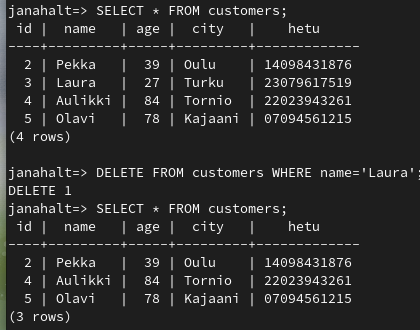

## <a href="https://terokarvinen.com/2023/eettinen-hakkerointi-2023/#h5-injected-sequel">h5 Injected Sequel</a>

"*Nyt olisi tarjolla OWASP 2017 numero uno, SQL injektio. Kannattaa aloittaa saman tien, niin ehdit ratkoa tehtäviä monena päivänä.*" 

### Lue/katso/kuuntele ja tiivistä

#### Karvinen 2016: <a href="https://terokarvinen.com/2016/03/05/postgresql-install-and-one-table-database-sql-crud-tutorial-for-ubuntu/">PostgreSQL Install and One Table Database - SQL CRUD tutorial for Ubuntu</a>

(Virtuaaliympäristöä ei tarvita, voi aloittaa kohdasta "Three line install")

- getting help; example:
  
  ```sql
   \h for help with SQL commands
   \? for help with psql commands
   \q to quit
  ```
  
  - PostgreSQL internal commands use '\' plus some letters
  
  - PostgreSQL command help is '\' and question mark -> **\?**
    
    - it uses "*less*" to show help, so you can use "**q**" to exit
    
    - 
  
  - PostgreSQL also has a full SQL reference built in, example:
  
  ```sql
  tero=> \h SELECT
  ```

- C: create table
  
  ```sql
  tero=> CREATE TABLE students (id SERIAL PRIMARY KEY, name VARCHAR(200);;);
  CREATE TABLE
  ```
  
  - **serial id field** as **primary key** should be set for every table -> easier to work with integers than UTF-8 strings
  
  - Postgre *SERIAL* is similar to MySQL *AUTO_INCREMENT*

- C: Create records: INSERT
  
  ```sql
  tero=> INSERT INTO students(name) VALUES ('Tero');
  INSERT 0 1
  ```
  
  - above you can see examples, how to add records to the table
  
  - parenthesis around values are *required* 
  
  - use single quotes, double quotes are not accepted 
  
  - example of how to create a record and then open it for editing:
  
  ```sql
  tero=> INSERT INTO students(name) VALUES ('Liisa') RETURNING id, name;
   id | name
  ----+-------
   5 | Liisa
  (1 row)
  ```

- R: Read: SELECT
  
  - you can make a query to the database, so that it shows you just records based on some criteria - for example numbers (*...WHERE year>2003*) or text (see picture below)
  
  ```sql
  tero=> SELECT * FROM students WHERE name LIKE 'Ma%';
   id | name
  ----+-------
   2 | Matti
   4 | Maija
  (2 rows)
  ```

- U: UPDATE
  
  - to  update some record, use following syntax
  
  - *remember to use single quotes!*
  
  ```sql
  tero=> UPDATE students SET name='Tero Karvinen' WHERE name='Tero';
  ```

- D: DELETE
  
  - to delete records, use following syntax
  
  - example query deletes a record "Liisa"
  
  ```sql
  tero=> DELETE FROM students WHERE name='Liisa';
  ```

#### OWASP 2017: <a href="https://owasp.org/www-project-top-ten/2017/A1_2017-Injection">A1: 2017 - Injection</a>

- Injection was nr.1 in OWASP Top Ten in 2017

- basically  any source of data can be used as an injection vector: environment variables, parameters, internal web services, and more

- injection flaw makes it possible for an attacker to send malicious data to an interpreter

- injection flaws are very prevalent (yleisiä) and can be found for example in SQL, LDAP or noSQL queries, SMTP headers, ...

- Injection can result in data loss, corruption or disclosure to unauthorized parties, loss of accountability, DoS or even complete host takeover

- preventing injection requires keeping data (in app code) separate from commands and queries

#### PortSwigger Academy: <a href="https://portswigger.net/web-security/sql-injection">SQL injection</a>

- Kaikki muut luvut paitsi ei "Blind SQL injection"

- Tämä kappale kannattaa pitää näkyvissä injektioita tehdessä <a href="https://portswigger.net/web-security/sql-injection/cheat-sheet">SQL injection cheat sheet</a>

- *SQL injection* (SQLi) is a web security vulnerability that allows an attacker to modify queries that an application makes to its database

- it may result in attacker being able to see, modify or even delete the data they are normally not able to retrieve, for example passwords, credit card details, personal user information

- SQL injections can be manually detected by systematically testing every single entry point in the application by, for example, submitting the single quote character **'** or boolean conditions (**OR 1=1** and **OR 1=2**), ...

- most of SQL injection vulnerabilities might be found also with Burp Scanner

- SQL injection vulnerability can occur at any location within the query, and within different types, for example in UPDATE/INSERT/SELECT statements

- examples of SQL injections: retrieving hidden data, subverting appplication logic (changing a query to interfere with the app's logic), UNION attacks (retrieve data from different database tables), blind SQL injection (queried results are not returned in the app's responses)

#### Vapaaehtoinen: Karvinen 2019:  <a href="https://terokarvinen.com/2019/05/22/mitmproxy-on-kali-and-xubuntu-attack-and-testing/?fromSearch=mitmproxy">MitmProxy on Kali and Xubuntu - attack and testing</a>

(Nykyisin asennus 'sudo apt-get install mitmproxy')

### a) CRUD

"*Tee uusi PostgreSQL-tietokanta ja demonstroi sillä create, read, update, delete (CRUD). Keksi taulujen ja kenttien nimet itse. Taulujen nimet monikossa, kenttien nimet yksikössä, molemmat englanniksi.*"

Keksin tällaisen tietokannan:

![](data:image/png;base64,iVBORw0KGgoAAAANSUhEUgAAAJkAAADfCAYAAADlXXHLAAAAAXNSR0IArs4c6QAAEL90RVh0bXhmaWxlACUzQ214ZmlsZSUyMGhvc3QlM0QlMjJhcHAuZGlhZ3JhbXMubmV0JTIyJTIwbW9kaWZpZWQlM0QlMjIyMDIzLTExLTIzVDIxJTNBNTUlM0E1NS45ODBaJTIyJTIwYWdlbnQlM0QlMjJNb3ppbGxhJTJGNS4wJTIwKFdpbmRvd3MlMjBOVCUyMDEwLjAlM0IlMjBXaW42NCUzQiUyMHg2NCklMjBBcHBsZVdlYktpdCUyRjUzNy4zNiUyMChLSFRNTCUyQyUyMGxpa2UlMjBHZWNrbyklMjBDaHJvbWUlMkYxMTkuMC4wLjAlMjBTYWZhcmklMkY1MzcuMzYlMjBFZGclMkYxMTkuMC4wLjAlMjIlMjBldGFnJTNEJTIyRGpwVjAtT1d3MWJhR0YxUF9zbzklMjIlMjB2ZXJzaW9uJTNEJTIyMjIuMS4zJTIyJTNFJTBBJTIwJTIwJTNDZGlhZ3JhbSUyMG5hbWUlM0QlMjJTaXZ1LTElMjIlMjBpZCUzRCUyMk5hQ1FDVGNldHFUblVranhhSXlCJTIyJTNFJTBBJTIwJTIwJTIwJTIwJTNDbXhHcmFwaE1vZGVsJTIwZHglM0QlMjIxMzg2JTIyJTIwZHklM0QlMjI3NTElMjIlMjBncmlkJTNEJTIyMSUyMiUyMGdyaWRTaXplJTNEJTIyMTAlMjIlMjBndWlkZXMlM0QlMjIxJTIyJTIwdG9vbHRpcHMlM0QlMjIxJTIyJTIwY29ubmVjdCUzRCUyMjElMjIlMjBhcnJvd3MlM0QlMjIxJTIyJTIwZm9sZCUzRCUyMjElMjIlMjBwYWdlJTNEJTIyMSUyMiUyMHBhZ2VTY2FsZSUzRCUyMjElMjIlMjBwYWdlV2lkdGglM0QlMjI4MjclMjIlMjBwYWdlSGVpZ2h0JTNEJTIyMTE2OSUyMiUyMG1hdGglM0QlMjIwJTIyJTIwc2hhZG93JTNEJTIyMCUyMiUzRSUwQSUyMCUyMCUyMCUyMCUyMCUyMCUzQ3Jvb3QlM0UlMEElMjAlMjAlMjAlMjAlMjAlMjAlMjAlMjAlM0NteENlbGwlMjBpZCUzRCUyMjAlMjIlMjAlMkYlM0UlMEElMjAlMjAlMjAlMjAlMjAlMjAlMjAlMjAlM0NteENlbGwlMjBpZCUzRCUyMjElMjIlMjBwYXJlbnQlM0QlMjIwJTIyJTIwJTJGJTNFJTBBJTIwJTIwJTIwJTIwJTIwJTIwJTIwJTIwJTNDbXhDZWxsJTIwaWQlM0QlMjJSaElnOFZVZU5CZ2hrTTdMUFRoZi0xJTIyJTIwdmFsdWUlM0QlMjJDVVNUT01FUlMlMjIlMjBzdHlsZSUzRCUyMnRleHQlM0JzdHJva2VDb2xvciUzRG5vbmUlM0JmaWxsQ29sb3IlM0Rub25lJTNCaHRtbCUzRDElM0Jmb250U2l6ZSUzRDI0JTNCZm9udFN0eWxlJTNEMSUzQnZlcnRpY2FsQWxpZ24lM0RtaWRkbGUlM0JhbGlnbiUzRGNlbnRlciUzQiUyMiUyMHBhcmVudCUzRCUyMjElMjIlMjB2ZXJ0ZXglM0QlMjIxJTIyJTNFJTBBJTIwJTIwJTIwJTIwJTIwJTIwJTIwJTIwJTIwJTIwJTNDbXhHZW9tZXRyeSUyMHglM0QlMjIzNDAlMjIlMjB5JTNEJTIyODAlMjIlMjB3aWR0aCUzRCUyMjEwMCUyMiUyMGhlaWdodCUzRCUyMjQwJTIyJTIwYXMlM0QlMjJnZW9tZXRyeSUyMiUyMCUyRiUzRSUwQSUyMCUyMCUyMCUyMCUyMCUyMCUyMCUyMCUzQyUyRm14Q2VsbCUzRSUwQSUyMCUyMCUyMCUyMCUyMCUyMCUyMCUyMCUzQ214Q2VsbCUyMGlkJTNEJTIyUmhJZzhWVWVOQmdoa003TFBUaGYtMzMlMjIlMjB2YWx1ZSUzRCUyMiUyMiUyMHN0eWxlJTNEJTIyZW5kQXJyb3clM0RjbGFzc2ljJTNCaHRtbCUzRDElM0Jyb3VuZGVkJTNEMCUzQmV4aXRYJTNEMC41JTNCZXhpdFklM0QxJTNCZXhpdER4JTNEMCUzQmV4aXREeSUzRDAlM0IlMjIlMjBwYXJlbnQlM0QlMjIxJTIyJTIwc291cmNlJTNEJTIyUmhJZzhWVWVOQmdoa003TFBUaGYtMSUyMiUyMGVkZ2UlM0QlMjIxJTIyJTNFJTBBJTIwJTIwJTIwJTIwJTIwJTIwJTIwJTIwJTIwJTIwJTNDbXhHZW9tZXRyeSUyMHdpZHRoJTNEJTIyNTAlMjIlMjBoZWlnaHQlM0QlMjI1MCUyMiUyMHJlbGF0aXZlJTNEJTIyMSUyMiUyMGFzJTNEJTIyZ2VvbWV0cnklMjIlM0UlMEElMjAlMjAlMjAlMjAlMjAlMjAlMjAlMjAlMjAlMjAlMjAlMjAlM0NteFBvaW50JTIweCUzRCUyMjMyOC40OSUyMiUyMHklM0QlMjIxMjAlMjIlMjBhcyUzRCUyMnNvdXJjZVBvaW50JTIyJTIwJTJGJTNFJTBBJTIwJTIwJTIwJTIwJTIwJTIwJTIwJTIwJTIwJTIwJTIwJTIwJTNDbXhQb2ludCUyMHglM0QlMjIzOTAlMjIlMjB5JTNEJTIyMTYwJTIyJTIwYXMlM0QlMjJ0YXJnZXRQb2ludCUyMiUyMCUyRiUzRSUwQSUyMCUyMCUyMCUyMCUyMCUyMCUyMCUyMCUyMCUyMCUyMCUyMCUzQ0FycmF5JTIwYXMlM0QlMjJwb2ludHMlMjIlMjAlMkYlM0UlMEElMjAlMjAlMjAlMjAlMjAlMjAlMjAlMjAlMjAlMjAlM0MlMkZteEdlb21ldHJ5JTNFJTBBJTIwJTIwJTIwJTIwJTIwJTIwJTIwJTIwJTNDJTJGbXhDZWxsJTNFJTBBJTIwJTIwJTIwJTIwJTIwJTIwJTIwJTIwJTNDbXhDZWxsJTIwaWQlM0QlMjJSaElnOFZVZU5CZ2hrTTdMUFRoZi0zNCUyMiUyMHZhbHVlJTNEJTIySUQlMjAoc2VyaWFsbnIpJTIyJTIwc3R5bGUlM0QlMjJzd2ltbGFuZSUzQmZvbnRTdHlsZSUzRDAlM0JjaGlsZExheW91dCUzRHN0YWNrTGF5b3V0JTNCaG9yaXpvbnRhbCUzRDElM0JzdGFydFNpemUlM0QyNiUzQmZpbGxDb2xvciUzRG5vbmUlM0Job3Jpem9udGFsU3RhY2slM0QwJTNCcmVzaXplUGFyZW50JTNEMSUzQnJlc2l6ZVBhcmVudE1heCUzRDAlM0JyZXNpemVMYXN0JTNEMCUzQmNvbGxhcHNpYmxlJTNEMSUzQm1hcmdpbkJvdHRvbSUzRDAlM0J3aGl0ZVNwYWNlJTNEd3JhcCUzQmh0bWwlM0QxJTNCJTIyJTIwcGFyZW50JTNEJTIyMSUyMiUyMHZlcnRleCUzRCUyMjElMjIlM0UlMEElMjAlMjAlMjAlMjAlMjAlMjAlMjAlMjAlMjAlMjAlM0NteEdlb21ldHJ5JTIweCUzRCUyMjMyMCUyMiUyMHklM0QlMjIxNjAlMjIlMjB3aWR0aCUzRCUyMjE0MCUyMiUyMGhlaWdodCUzRCUyMjE0MCUyMiUyMGFzJTNEJTIyZ2VvbWV0cnklMjIlMjAlMkYlM0UlMEElMjAlMjAlMjAlMjAlMjAlMjAlMjAlMjAlM0MlMkZteENlbGwlM0UlMEElMjAlMjAlMjAlMjAlMjAlMjAlMjAlMjAlM0NteENlbGwlMjBpZCUzRCUyMlJoSWc4VlVlTkJnaGtNN0xQVGhmLTM2JTIyJTIwdmFsdWUlM0QlMjJuYW1lJTIwKHN0cmluZyklMjIlMjBzdHlsZSUzRCUyMnRleHQlM0JzdHJva2VDb2xvciUzRG5vbmUlM0JmaWxsQ29sb3IlM0Rub25lJTNCYWxpZ24lM0RsZWZ0JTNCdmVydGljYWxBbGlnbiUzRHRvcCUzQnNwYWNpbmdMZWZ0JTNENCUzQnNwYWNpbmdSaWdodCUzRDQlM0JvdmVyZmxvdyUzRGhpZGRlbiUzQnJvdGF0YWJsZSUzRDAlM0Jwb2ludHMlM0QlNUIlNUIwJTJDMC41JTVEJTJDJTVCMSUyQzAuNSU1RCU1RCUzQnBvcnRDb25zdHJhaW50JTNEZWFzdHdlc3QlM0J3aGl0ZVNwYWNlJTNEd3JhcCUzQmh0bWwlM0QxJTNCJTIyJTIwcGFyZW50JTNEJTIyUmhJZzhWVWVOQmdoa003TFBUaGYtMzQlMjIlMjB2ZXJ0ZXglM0QlMjIxJTIyJTNFJTBBJTIwJTIwJTIwJTIwJTIwJTIwJTIwJTIwJTIwJTIwJTNDbXhHZW9tZXRyeSUyMHklM0QlMjIyNiUyMiUyMHdpZHRoJTNEJTIyMTQwJTIyJTIwaGVpZ2h0JTNEJTIyMjYlMjIlMjBhcyUzRCUyMmdlb21ldHJ5JTIyJTIwJTJGJTNFJTBBJTIwJTIwJTIwJTIwJTIwJTIwJTIwJTIwJTNDJTJGbXhDZWxsJTNFJTBBJTIwJTIwJTIwJTIwJTIwJTIwJTIwJTIwJTNDbXhDZWxsJTIwaWQlM0QlMjJSaElnOFZVZU5CZ2hrTTdMUFRoZi0zNyUyMiUyMHZhbHVlJTNEJTIyYWdlJTIwKGludGVnZXIpJTI2bHQlM0JiciUyNmd0JTNCJTI2bHQlM0JiciUyNmd0JTNCY2l0eSUyMChzdHJpbmcpJTI2bHQlM0JiciUyNmd0JTNCJTI2bHQlM0JiciUyNmd0JTNCaGV0dSUyMChzdHJpbmcpJTIyJTIwc3R5bGUlM0QlMjJ0ZXh0JTNCc3Ryb2tlQ29sb3IlM0Rub25lJTNCZmlsbENvbG9yJTNEbm9uZSUzQmFsaWduJTNEbGVmdCUzQnZlcnRpY2FsQWxpZ24lM0R0b3AlM0JzcGFjaW5nTGVmdCUzRDQlM0JzcGFjaW5nUmlnaHQlM0Q0JTNCb3ZlcmZsb3clM0RoaWRkZW4lM0Jyb3RhdGFibGUlM0QwJTNCcG9pbnRzJTNEJTVCJTVCMCUyQzAuNSU1RCUyQyU1QjElMkMwLjUlNUQlNUQlM0Jwb3J0Q29uc3RyYWludCUzRGVhc3R3ZXN0JTNCd2hpdGVTcGFjZSUzRHdyYXAlM0JodG1sJTNEMSUzQiUyMiUyMHBhcmVudCUzRCUyMlJoSWc4VlVlTkJnaGtNN0xQVGhmLTM0JTIyJTIwdmVydGV4JTNEJTIyMSUyMiUzRSUwQSUyMCUyMCUyMCUyMCUyMCUyMCUyMCUyMCUyMCUyMCUzQ214R2VvbWV0cnklMjB5JTNEJTIyNTIlMjIlMjB3aWR0aCUzRCUyMjE0MCUyMiUyMGhlaWdodCUzRCUyMjg4JTIyJTIwYXMlM0QlMjJnZW9tZXRyeSUyMiUyMCUyRiUzRSUwQSUyMCUyMCUyMCUyMCUyMCUyMCUyMCUyMCUzQyUyRm14Q2VsbCUzRSUwQSUyMCUyMCUyMCUyMCUyMCUyMCUzQyUyRnJvb3QlM0UlMEElMjAlMjAlMjAlMjAlM0MlMkZteEdyYXBoTW9kZWwlM0UlMEElMjAlMjAlM0MlMkZkaWFncmFtJTNFJTBBJTNDJTJGbXhmaWxlJTNFJTBBV9Q6TAAAGcJJREFUeF7tnQuwV9MXx9dlvEoi76KEXEwhptwhPTCGpEwmYRpND49QSunhESIV6UYqr2oaRC5RkjdJmtSMwp2SjKZIGAY9CMP9z3f7r9P67XvO+Z19fr/z+3Xub50Zk3vv3mfv/d2fs/ba+5y1d1mjRo1qSC9VIEEFyhSyBNXVWxsFFDIFIXEFFLLEJdYCFDJlIHEFFLLEJdYCFDJlIHEFFLLEJdYCFDJlIHEFFLLEJdYCFDJlIHEFakFWVlZGFRUVdMUVV1CbNm2ovLzcVGLz5s20Zs0aeuWVV+i1116jbdu2ZVTugAMOoKlTp1Lnzp3N7++++26aMmWKbwMGDhxo/o5r0aJFdOONN9LWrVsz0jZp0oR69epFHTt2pBNPPJFw/x07dtBXX31Fy5cvp2eeecbUx74mTpxIffr0cRJu1qxZNGzYMC+P1OD000+nZs2aUf369enHH3+kdevW0VtvvUUvvPAC/fTTT7XKQb1nz55NrVu3zvjbDTfcQHPnzq2V/vzzz6dp06bRwQcf7P1tw4YNNGDAAFq5cqVpt9Q1SsNWrVpFvXv3Nn2GS+odlB9tQ7nvv/8+Pfnkk/Trr7/6Jj3wwAPpqquuogsuuMCwcdhhh5l00AX1ff75503/1NTseluZAVnjxo3pjjvuoC5duhhRgy509F133UVvvPGGlySfkAHUMWPGUPPmzQPrACgffPBBmj59ekaDcoUMGtx55510+eWXh/YnOvDRRx+lGTNm0D///OOlDYLs6aefpuHDh9Nff/2Vcd+RI0fSrbfemvG7YkAmKwBIbrrpJgOdvPDAQfPTTjstUBsYArQV/ffnn3+adB5k6NDKyko655xzojwstH79eho8eLChFle+IDvllFPMk33SSSdlrQeePnTcq6++6qXNBbKmTZvSQw89ROeee27WspEAguKpf+CBBzxBgyD75JNPqG/fvvTNN98EPpj8h2JDhnrYD8URRxxBjz32WCQ+oMv48eNNP3qQ7b333nTvvfdS//79zS+RCEMiblpdXU3//vuvsSr9+vUzphJA4cLQCVP8+++/5w0yadoBMqBBXf744w/aZ5996LzzzqPRo0dTixYtTB1eeukluvnmm83fgy4Jnj00ch5oAOt8/fXXe7f58MMPzVC1dOlSc/+DDjqILrnkEjO8H3/88SYdQL/tttvo5ZdfNj/bkGHY2WuvvWjnzp2EIfOdd97x7t+yZUt6/PHH6eijj6a///6bMBThCoMszA0Jan829wTuwamnnkr33HMPtWvXztzmiy++oOuuu870Py60G1qw2wCDVFVVRb/88gvtueeedMYZZxjrBRcLFzS75pprjD7Gkp199tmGuqOOOsokeOKJJ4zPxOaOK4/KDB06lM4880xjPd5++23asmWL+XO+LJkEAr4NypPjO8rCwzBhwgRTru1/+AkdBTJbA7RvyJAhRkT7gs86efJkD3ToAB8KaW3IPvroIwNZ27ZtzVCDJ5wv+I6oGzoU/h13cKEh4/pceumlZvi3QcfPEtTXX3/dPGi//fZbhjQXXnghPfLII8a/lG0wkEm/AM40OhGOnMuVL8hkXfAUPPXUUzRnzhwPZpc6cdookMlyv/32W2N1AEjQJUHHgwbIYPlsyNAh8B979uyZMcmB5Zw0aRJdeeWVhDSYSLEfWCzIUEce4mQdoIH8G0a6Z5991rgKSGcbAVuzsiZNmtQ8/PDDdNlll5m/4QmG07d9+3an/swXZDC3cOZtpx9me8WKFfTBBx+YzvezMEEVzgbZfvvtR1KDoCdV3h+zRwx1xx13nPk1Jkyotw0ZZs8ff/yxGYrkEIQhcubMmQRnGhMIDMc8ASg0ZHBD4MyjjjzcLVu2jK699lrv4T7mmGMMgBjF5PX111+b9mF4RN/wyCbTlDVv3rwGY+1FF11kfh/ks2QjLl+QYUiG74dhkqfHdtmwDO+++64B4/PPP89WNTMk8bKGX/saNmxo/A0XDWyYAAp8Ovv3KA++CzoIHYWlEvxOLl3AaqKtvKyTq+OP5YuFCxd6ukRZwpAi2o47/y3brB/5MBGElkuWLPEsXFmrVq1q5LpOsSHjBrVq1co49HD0eaJh02Q73XEtmR8Yct3M775Befx+j9knhhb4XM899xzdcsst5j9YLgYKft7uABkeYPhVeChsnxw6YM0QD0XXrl0DjQBgQ5sBG4bSshYtWtRgFsnT9riQoQLSYuS6GMsdC8DgNKOD2rdvb2ZB8lq7dq1p9GeffRZo0bJZMjiqrhq4WDLMPtn/wlIGHp5Ro0aZhWuehcHnKSZk8EOxeI4VA79FZltcuBjoCyyWo2+w9CTXVmEABg0aZCaHZU2bNq2BqccUNRefzIaMhw+/ns82pQ4b/w455BCzmg3Hm4dT9ofiWrL999/f+EWsQRSfzPYdg3wyfmgxMbjvvvvo559/NmtxV199tXmTwTNoLJ3g77gK4ZPBSnXq1Mn4krwmuXr1amNd8SC4Xg0aNDB+Pfx59qcxaRsxYsR/SxhyZoW1KTh8YZYhbmdyPjiYqAwuuUyBhWA4z0ceeWSG0HZ5cmaGv2WzvtksGe5hzy7xIMCvCLownMIa4QqbXfKyhWzbp59+6llk9tHwlgVaFAoyfo1nL8f4rfZjTRDAwIXBUIjlC7kALjWSOvIrQ+d1MhSA91Z4f4ebyCkshgEslOLCeywMY5h9yMueIDDtSCNnXPgZvgEW+Owpsn2PMKtpW9ggIO11MjjOmHz4DR0u62TsNthts+EsFmSYaKFP8eaEh7v58+ebtzkMoq03JjLwKbEILy97UZ8Xyg1kmMLiacdqPi7QCpGx4AjLhstvxR8zPIDEHSEX45Bn8eLFNHbsWMKTi/d7mF0BRJhVbpB8cYwGw8qh0bjQSLzewOIw3hXusccedMIJJ5ixnteUUFfAgIbnYmGhAd56YGbLF5ZMsEzx5ptvmiWGQw891KxrYaiGT4YLwx98rhdffNH8bPtqDJm9TMIPIma9sITFggz1qFevnvEZe/To4fU/6o0lFr7kuiDzAR/uyy+/NG+E0G4M+XADuG/HjRtnuIr97tLvvSGIB5jdunUL7HD5ByxeomLff/+992tAhI6FIxnlCluZ5/xRhkukjfPu0n4ZHAQZ7i8tPX7mmSZemkeFLIomSCOXMaL4wHgthNkgv66Du4TXSoAIF3xhzDgx249yyWG31lcY999/v+cAB90MX2FgGMNwaQ9lUTsqzMnE0IXXRtlekr/33nvGim3atCm03VEhw02ifokCywoLi6UJOdW3IZOTEvuzHjkDD/JH43zqEwcy5MGoAp+KLRFeMeGLFG4fDACWJrJ9RGH3ba3vyfCyEz4HhqOzzjqLjj32WNOB/D0ZwFqwYEHg90ZsfvFkdu/enU4++WRvaJHfY+FVUdA3S7hH0HdL8PHwlOGFNKbHfms5NnEukCEvhm28vMbQCC3g+MrvyfCSG+Xz91qyPBsyaVGkA41hVr4wl7PVXBdj40KGDwDw4ptn2X6jFYZWv74N+95Qv4yNYvs1TU4KKGQ5yaeZoyigkEVRSdPkpIBClpN8mjmKAgpZFJU0TU4KKGQ5yaeZoyigkEVRSdPkpIBClpN8mjmKAgpZFJU0TU4KKGQ5yaeZoyigkEVRSdPkpIBClpN8mjmKAgpZFJVEGnxOzIHFjllLNrlC5tj1+HpC7sDjmL0kkytkjt2ukDkKpodFuAumkLlrppbMUTOFzFEwtWTugilk7pqpJXPUTCFzFEwtmbtgCpm7ZmrJHDVTyBwFU0vmLphC5q6ZWjJHzRQyR8HUkrkLppC5a6aWzFEzhcxRMLVk7oIpZO6aqSVz1EwhcxRMLZm7YAqZu2ZqyRw1U8gcBVNL5i6YQuaumVoyR80UMkfB1JK5C6aQuWumlsxRM4XMUTC1ZO6CKWTumqklc9RMIXMUTC2Zu2AKmbtmaskcNVPIHAVTS+YumELmrplaMkfNFDJHwdSSuQumkLlrppbMUTOFzFEwtWTugilk7pqpJXPUTCFzFEwtmbtgCpm7ZmrJsmiGszdvv/12cw4njkhkyHBMH055w5HOOMJPr2AFFLIsdOB8chwsi4NDcS4ljgbEYa84pRanyeF4vu3btytjIQooZBHwwOnDvXr1IgAnL+y4iPMf9QpXQCGLQAjgWrduHe27775e6p07d1J5eblasQj6KWQRREIS25qpFYsonM4uowslrZlasei6IaVaMge9YM369etHkyZNUl/MQTeFzEEsWDM4+sOHD1dfzEG3QMjmz59P7dq1c7iVJi1lBZYuXUrdunXzlSAQMl3ZLmVk3NsexotC5q6n5vBRQCFTLBJXQCFLXGItQCFTBhJXQCFLXGItQCFTBhJXoM5B1qZNGxo1ahQNHDjQiDd79mxq3bp1hpC9e/emhQsXBorLeadMmZJzB3Tp0oV69uxJ+PYMnwH5XbLOmzdvjlQmPivCO9KZM2fSypUrI+UpVqKSgGzy5MkeVOjQ6dOnm48K/UDD3/v27Us4IDUIinx3VhzIUIdi1DVO20sOMogES9W2bVtf6zJx4kRavHixByB+7tOnj9F21qxZNGzYMPP/DGvz5s1p1apVBOsIKwTLNWTIEGrYsCGtXbuWFixYQF27djVlNWjQIMOy8v0kZLC6gBxXhw4daMOGDTRgwADzORG+ssXrq/bt25vy8JDY9Y0DQdJ5ShKyIMvRpEkTGj9+PI0cOdIDhoc6dAQPT999952BhS0kOvrwww83IAEAWEmAgWGMh0vcE/desWIFYRhGHbgs3JuHeECGewOiJUuWGLB++OEHGjNmjPf/DDry4f4dO3b04E8amDj3V8iED2QPP0H+FH4/ePBgz3rZlkj+LegeABqwjRs3zvSbhEzmh9Vt1qyZBxlDyp2dhiGzJCGzIeEO8wMCnQzLhAv/Agykg7WRFw9rsGjS0Zf3hJWT+TiPDZnMb0M2d+7cDF9SIYtjW3PM4ze7lI5/mE8W1mGYzWHoQifjCpox2qDyzxy5xHUJs2QKGZEX+pUjD4lkzwZZ2OzS9snYisAHkksGtk+GdPiUBX4UfCo/S2ZDhjxID98tF0umPlkiGIXfNNd1MjlbY+vVuXPnjOHSnl3ysCcdfV4Xk5YNUPHQiw8cW7ZsaSwjHHvpk7lYMp1dFgGyXItMg4+TJqcfda1zjn+ukLHPhn/zseKfj/r43UNX/JNSVu+bSgXUkqWy29JVaYUsXf2VytoqZKnstnRVWiFLV3+lsrYKWSq7LV2VVsjS1V+prG0syPD9VNOmTVPZYK104RXYtGlTra+TuRYa3Fv4/qiTJcayZLpNQZ1kIbFGKWSJSas3ZgUUMmUhcQUUssQl1gIUMmUgcQUUssQl1gIUMmUgcQXqLGRRvnDFp8sbN270/TgxyvYCYb2Thm/vE6fr/wXUSciifjUaBlk+OiAN39/no53Z7pFXyDiIY8eOHcTBF3JzExnDaIffV1dXU48ePQhh/wi2QEArtgeQWwDYgR1BG6fYVkTGSfL9unfvnhFPifr4bS/Akd8I9vDbrkDeG9sOcCQ59tGIYk2zdVBd+HveIcNmJghgxffxdvi+jIzG33Bx+D3+n8P8kR+g4V/EOnLUNOdBiBo6V24HIDtDWhAZ34hoIrljj7Rk9v3s7QVk/bhcGRrHWwpwOkAW1aLWBZDC2pB3yHh/B7/wMFmRoPB7e58KBmHevHkZ+0/IYFu5O4/dsTZkNozsk9lR5UF7WMj7hUWL845AOmTmOVrJBkQ6z+hcWCUeRvEzhhe2ZBx+nw0ye68x3jqA4fGDSu7As2jRIm83H9uS+QXl8nDJ9ZP3r6ioyNgdyG+yoJAVEDL4T3K7pqA9HsIg4w1KwjZ9yzZEyajwXCFTSxZtoM/7cMmR0LxXF1sHCRnv07V69erIlox9PDQLPlnYdgPSetjQhvlkrpZMfbLdDDK5ARxmeHPmzKFOnTqZvcDgx2UbLgFZ2LYBsrn27FLOauVwyb/HkIvZpStk7HdigoL8VVVVZusB3qJAZ5f/9UpeLVk0rpNPlW3ITKoGcvaLMtQfq8OQoWmFsCJyQoEypZXUFf9dj3KdtGRJWSq9bzwFFLJ4umkuBwUUMgexNGk8BRSyeLppLgcFFDIHsTRpPAUUsni6aS4HBRQyB7E0aTwFFLJ4umkuBwUUMgexNGk8BRSyeLppLgcFFDIHsTRpPAUUsni6aS4HBRQyB7E0aTwFFLJ4umkuBwUUMgexNGk8BVIHGX8nhlPX5Be1Qc2Pe753HDkL8Q1bnHoVO0+qIIvzxWshIUNnyhiCYnfu7lJ+3iGzT7X1iyDH9/D4Ph6R5nyWpAyXixIZLuMu+Sg/O3IdsQT4/h5hdBw53rhxY0IAsn1APQPC3/tHqR+fI468NTU15vxKXPIc892lo4tZj7xCJg9v52htDoMrLy/3xOcoH0QrAbI4keE2ZEGR6yiXI6ggdNAB9XHqh/uhXIApA4z12/5MpPMKmf202AeKYn8LQMVWAz9XVlbGigy3IQuKXJeQwaIFHVCPvTFc6wcLKsvl9uuQmTBkeIp5YxIUxcEVo0ePNiUHQeYaGe43XKJz7XhPG7KgA+oRDudav+XLl3tWEuUqZP6Dcl4tWdB+EohDhL8SZCniRIbHhSzogHoZWW5b2qD6BU0q1JIlaMkkZNu2bTN7X+ACZFF9nqiR4XEgs30yeUA9JgQ89IX5jLJ+8uxwacnUJ0sQMhnhjRnktGnTzBZPPIxxxDZmesuWLaN69er5zi7tTVS4yjKWMSpkHLmOe8CaytmlPKBezi6j1s/PkmFDFp1dJghZ1GkyA8L7jrnkmzBhAs2cOdMsgSR1xa0fg4p/d+fzy5PSLei+efXJwipvr59h2yieBLg0OqlV9XzUL6m6ueizO6YtGGS7Y+O1ToVRQCErjM4lXYpCVtLdX5jGK2SF0bmkS1HISrr7C9N4hawwOpd0KQpZSXd/YRqvkBVG55IuRSEr6e4vTOMVssLoXNKlKGQl3f2FabxCVhidS7oUhayku78wjVfICqNzSZeikJV09xem8QpZYXQu6VIUspLu/sI0XiErjM4lXUpBIJMBFwjkkGdiRlU/yqfN8pBU+75+p+pGLRvp9EAuF7Uy0xYEMllknA1Qom60EgZZfIl25dRQt3gq5h0yhIT5bXIC6zV27FhCtBFvgLJ+/Xpas2aNF9kTFBRrWxEZ9MEbqWCbAYTS4eJNU4YMGUINGzaktWvX0oIFC6hr167eIa6ImeRIdxnUIu+N3+MIaD0kNR5cnCuvkMlYSGxAwlHZOJWXh0g5XAI2juhGhYLC3aQFsQ+yDzvuGbANGDDAhM/xcMknBaM8wNO+fXsDJdLpcc+5wRSUO6+QBQ2FQT4ZKsWBsICvb9++NGLECNq6datXX3uotCGTDbMPrpebq9iQccynvJ8eXJ8CyOy9MLjKYY4/WynsF4bLDor1g0qemCtPy7Uhcz1TvKKignirK4DuN1lQv8wdxKJaMt6B5+KLLzY194sMz+b0y41ScoVMLZk7QFFy5BUydvonT55sNoUDALAMM2bMoEGDBpmf7SUMzrNlyxbPwbYrLq2HPSSH+WSulkx9sijIuKfJK2QoXg5lcgtNe7dDpMUGKLBm2ZYe7Nklb9yCe8jhkn/Ps0tXyHiCgNkxNmOpqqqili1b6uzSnauMHHmHzLU+YY483yvbkOlaZtT0cptR5FF/LKpymemKChlbPViObLvgRFnxjyfBrlzSCttWUlf846tbVMjiV1tzpkkBhSxNvZXSuipkKe24NFVbIUtTb6W0rgpZSjsuTdVWyNLUWymtq0KW0o5LU7UVsjT1VkrrqpCltOPSVG2FLE29ldK6KmQp7bg0VVshS1NvpbSuCllKOy5N1VbI0tRbKa2rQpbSjktTtRWyNPVWSuuqkKW049JUbYUsTb2V0rrmFbI4+1xAt2yBJGHaZvvuPqxOcevL9SnEJ+Ep5Sqj2qmGLMp397mClK2T9VD7bAoRJQJZdXW1CSOzz/iWm5lwKBvC4uyNUmQomwzelc2xI5jk+edIh3vOmzcvY/OXSZMm0dChQ81tampqCD/379/fxINiXw5sk4CrQ4cOGXWXm8ig3vXr16dx48aZPTb0zPEiQDZ9+nTTsYg+wlDGu+KUl5d7+16sW7eOpk6dSthZB0dEh0V+B0FmD1Uynex4GUzMh9wDQAQfSysHyFBvQL9kyZJa9YOUqCvKQRreyIWH+8WLF5t76lVbgbxbMt5ARe6kA6uGjgnaZ2L06NG0ceNGA6a9/0QQZH4Bv82aNat1rrm9D4esnw2Z3KCFy62srDT1kpZL/gxJdcgMf7TyDpncRVECI4dFrhJHmGMfMVfI/OCDReQ9x1Ceba3sLRJsyPyGaWx7JcH0C0ZWyHYjyPwsjT27tC2ZHcXNzQlz+iUISO+3Nxq2R4gCmVqy3B2Aglky6ZNhKJX+mj1c2pvSrV692ncYlPuZSb8uzCeTljYKZOwzqk8WH7aCQcb7fcG5xsVDJSyK3CiFJwwY9pBm2bJlVK9evVqQ+W2Ox9uI4v48XPLMEL+Ts8molgyQydklJizYhEVnl9Ghyytk0YvNT8oo62T5KWnXXeyN/tQfy65wqiErxPKBvf4m1/50xT87YEiResiiNVNTFVMBhayY6pdI2QpZiXR0MZupkBVT/RIpWyErkY4uZjMVsmKqXyJlK2Ql0tHFbKZCVkz1S6RshaxEOrqYzVTIiql+iZQdC7L58+dTu3btSkQibWauCixdupS6devme5uyRo0a1eRagOZXBcIUUMiUj8QV+B8EsfnHnTGuogAAAABJRU5ErkJggg==)

Sitten tietokannan asennukseen. Aloitin päivittämällä konettani ```sudo apt-get update``` ja sitten komennolla ```sudo apt-get -y install postgresql``` . Se ```-y```  komennossa  tarkoittaa, että mikäli järjestelmä kysyy asennuksen aikana jotakin kysymyksiä, niin niihin automaattisesti vastataan "kyllä".  Käynnistys komennolla ```sudo systemctl start postgresql``` ja komennolla ```sudo systemctl status postgresql``` tarkistin, että postgre on käynnissä:


Halusin luoda uuden käyttäjän, jonka käyttäjänimeä sitten hyödyntäisin myös postgre tietokantaa käyttäessäni. Joten komennolla ```sudo useradd -m janahalt ``` loin käyttäjän **janahalt**, parametri **-m** luo käyttäjälle kotikansion (mikäli sellainen ei vielä ole olemassa). Ja komennon ```sudo passwd janahalt``` avulla määritin luodulle käyttäjälle uuden salasanan.


Sitten vielä lisäsin käyttäjän sudo-ryhmään ```sudo usermod -a -G sudo janahalt``` ja määritin sen oletus shelliksi bashin ```sudo chsh -s /bin/bash janahalt```.  

Kun halusin luoda tietokannan komennola ```sudo -u postgres createdb janahalt``` sain tällaisen virheen:


StackOverflowsta löysin ketjun PostgreSQL kuuntelevien <a href="https://stackoverflow.com/questions/3278379/how-to-configure-postgresql-to-accept-all-incoming-connections">osoitteiden/porttien muokkaamisesta</a>. Joten menin **postgresql.conf** tiedostoon (sijaitsee kansiossa **/etc/postgresql/16/main**) ja otin pois **#** ```listen_addresses``` parametrin edestä, jotta se ei olisi pelkkä kommentti ja muutin portin 5433 (joka siellä oli valmiiksi) 5432:ksi, josta sain virheilmoituksen (kuva tuolla ylempänä).


Sen jälkeen sain ajettua komennon ```sudo -u postgres createdb janahalt``` ilman virheilmoituksia. Sitten vielä loin postgresql-tietokantaan käyttäjän **janahalt** komennolla ```sudo -u postgres createuser janahalt```. Tero Karvisen <a href="https://terokarvinen.com/2016/03/05/postgresql-install-and-one-table-database-sql-crud-tutorial-for-ubuntu/">artikkelissa</a> neuvotaan laittamaan sekä PostgreSQL tietokannan, että PostgreSQL käyttäjän nimet samanlaisiksi, jotta autentikointi olisi automaattista. Lopuksi menin tietokantaan komennolla ```psql```:


Tämän jälkeen yritin lukemattomia kertoja luoda taulukon, jossa olisi sarakkeet **id**, **nimi**, **age**, **city** ja **hetu**. Joka ikinen kerta sain jotain tämän tyypistä virheilmoitusta:


Ei auttanut, vaikka erikseen annoin kaikki oikeuden **janahalt** käyttäjälle erikseen:


Silti sain saman virheen... *permission denied for schema public*. Tässä kohtaa alkoi jo vitsit loppumaan, en enää tiennyt mitä kokeilisin. Jopa <a href="https://www.postgresql.org/docs/16/ddl-schemas.html#DDL-SCHEMAS-PRIV">PostgreSQL dokumentaatiossa</a> lukee, että oletuksena kaikilla (käyttäjillä) on oikeus käyttää schema public. 

---

Kokeilen suorittaa tätä tehtävää vielä Fedora virtuaalikoneella, kun se on minulla jo valmiiksi asennettuna. Ellen onnistu, niin teen PortSwigger tehtävät ja palaan tähän sen jälkeen.

Eli ensin päivitin virtuaalikonetta, sitten asensin postgesql:n ja enabloin sen. Alustin tietokannan ja käynnistin postgresql palvelimen.

- **sudo dnf update**

- **sudo dnf install postgresql-server postgresql-contrib** 

- **sudo systemctl enable postgresql** 

- **sudo postgresql-setup --initdb --unit postgresql**

- **sudo systemctl start postgresql** 

Sitten jatkoin tietokantakäyttäjän ja tietokannan luomiseen. Dokumentaation mukaan, se pitää tehdä *postgres*-tietokantakäyttäjän tililtä:

- **sudo -u postgres psql**

Nyt se tietokantakäyttäjä ja tietokanta:

- postgres=# CREATE USER janahalt WITH PASSWORD 'janahalt';

- postgres=# CREATE DATABASE janahalt OWNER janahalt;

Ei ole tietenkään millään lailla tietoturvan kannalta järkevää laittaa kaikki (käyttäjä, salasana, muut) samannimisiksi. Tässä tein niin vain kokeillakseni, onnistunko tekemään tätä tehtävää.

**C: CREATE TABLE**: Luodaan taulukko:


**C: Create Records: INSERT**: Nyt lisätään taulukkoon tietoja:


...ja vähän lisää:


Viimeisimmän lisäyksen kohdalla samalla avasin sen muokattavaksi (Olavi).

**R: Read: SELECT**: Katsotaan nyt vaikka pelkästään kaupungit, joissa meidän kuvitteelliset asiakkaat asuvat:


**U: UPDATE**: 

Päivitetään vaikka Olavin asuinkapunki Kuopiosta Kajaaniksi ja tarkistetaan, että se on päivitetty:


**D: DELETE**:

Kokeillaan vielä poistaa tietoja taulukosta. Ensin tarkistan kaikki taulukossa olevat asiakkaat, sitten poistan yhden ja vielä tarkistan lopputuloksen:



### b) SQLi me

"*Kuvaile yksinkertainen SQL-injektio, ja demonstroi se omaan tietokantaasi psql-komennolla. Selitä, mikä osa on käyttäjän syötettä ja mikä valmiina ohjelmassa. (Tässä harjoituksessa voit vain kertoa koodista, ei siis tarvitse välttämättä koodata sitä ohjelmaa, joka yhdistää käyttäjän syötteen SQL:n)*"

Tietokantani sisältää tietoja kaupan asiakkaista - id, nimi, ikä, asuinkaupunki ja hetu (henkilötunnus). Tässä kuvitteellisessa tilanteessa minulla olisi jokin suojaus, ettei hyökkään olisi helppoa hakea tietoja sarakkeesta *hetu*. Esimerkkinä voisin hakea taulukosta asiakkaiden nimet ja heidän asuinkaupungit hakupyynnöllä `SELECT name, city FROM customers;` .

Hyökkääjä voisi SQL-injektiolla hakea tietokannastani asiakkaiden **kaikki** tiedot, eli myös ikä ja hetu. Hän todennäköisesti toteuttaisi sen muokkaamalla SQL hakupyyntöä (query) vastaavalla tavalla kuin aiemmin kurssilla tehdyssä harjoituksessa <a href="https://github.com/JanaHalt/Ethical-Hacking-2023/blob/main/h1%20Hacker%20Warmup.md#c-ratkaise-portswigger-labs-lab-sql-injection-vulnerability-in-where-clause-allowing-retrieval-of-hidden-data">SQL injection vulnerability in WHERE clause allowing retrieval of hidden data</a>. Eli lisäämällä minun omani hakupyynnön perään "kommenttimerkin" ```'-- ``` ja sen perään vielä koodin joka hakisi kaikki tiedot.

### PortSwigger Labs

#### d) <a href="https://portswigger.net/web-security/sql-injection/lab-login-bypass">SQL injection vulnerability allowing login bypass</a>

Tässä harjoituksessa yritetään päästä kirjautumaan ```administrator``` käyttäjänä.

Avasin labran -> **Access the lab**. Seuraavaksi klikkasin "My account", jotta pääsisin kirjautumissivulle. Käyttäjätunnukseksi laitoin **administrator** ja salasanaksi saman. En tietenkään suoraan päässyt kirjautumaan, vaan tuloksena oli "Invalid username or password".

Menin ZAPiin ja avasin siihen liittyvän POST hakupyynnön **Manual Request editorissa**.   Nyt pitäisi saada verkkosivu toimimaan siten, että se päästää meidät kirjautumaan administratorina, vaikka meillä ei ole oikea salasana. Eli tulisi saada se jättämään **password**-kenttää kokonaan huomiotta.

- pelkkä password parametrin poistaminen ei tuota tulosta, vaan vastauksena on *Missing parameter*

- <a href="https://portswigger.net/web-security/sql-injection/cheat-sheet">SQL Cheat Sheet</a> :n ja aiemmin tällä kurssilla opitun mukaan MySQLssa syöttämällä pyyntöön ```'-- ``` , eli kaksi viivaa plus yksi tyhjä "kommentoi pois" syötettä, joka tulee sen jälkeen. Kokeillaan se seuraavaksi:
  
  
  
  

#### e) <a href="https://portswigger.net/web-security/sql-injection/examining-the-database/lab-querying-database-version-oracle">SQL injection attack, querying the database type and version on Oracle</a>

Tässä harjoituksessa selvitetään tietokannan tyyppiä ja versiota (@Oracle). Harjoituksen tehtävänannossa kerrotaan, että voidaan käyttää UNION hyökkäystä saadaksemme tietoja muokkaamamme hakupyynnön/kyselyn tuloksista.

**UNION**  on termi, jota käyttämällä voi päästä käsiksi muihinkin tietokannassa oleviin taulukkoihin kuin siihen, johon alkuperäinen hakupyyntö oli kohdistettu. UNIONia käyttämällä voimme suorittaa yksi tai enemmänkin SELECT-hakupyyntöjä ja liittää niiden tulokset alkuperäiseen hakupyyntöön. <a href="https://portswigger.net/web-security/sql-injection/union-attacks">PortSwigger - SQL injection UNION attacks</a>. 

Avasin labran ja klikkasin kategorian "Lifestyle". Aiemmasta jo tiesin, että laittamalla jokin "paikkaan kuulumaton" merkki, kuten -> **'** <- voidaan testata onko tietokanta haavoittuva hyökkäyksille. Joten laitoin URL osoitekenttään URLn loppuun hipsun **'**.


Tästä seurasi **Internal Server Error**, mikä vahvisti sen, että tietokanta on haavoittuva hyökkäyksille. PortSwiggerin sivuilta löysin <a href="https://portswigger.net/web-security/sql-injection/examining-the-database#querying-the-database-type-and-version">tiedon</a>, että jos halutaan selvittää tietokannan versiota, niin Oraclen kohdalla se voidaan tehdä pyynnöllä ```SELECT * FROM v$version``` tai ```SELECT banner FROM v$version``` . Ko. komentoa voidaan käyttää aiemmin mainitun UNIONin kanssa.


Tuloksena oli edelleen vain **Internal Server Error**. Jatkoin siten, että poistin ylimääräiset merkit URLista (eli se oli taas ....?category=Lifestyle muotoinen) ja painoin enter. ZAPista avasin siihen liittyvän GET hakupyynnön **Manual Request Editorissa** ja **Encode/Decode/Hash** (haluttu pätkä hiiren oikealla klikkaamalla) työkalun avulla katsoin miltä hakupyyntöni pitäisi näyttää URLissa. Kopioin sen ja laitoin sen editorissa avattuun  GET hakupyyntöön. Edelleen **Internal Server Error**:


Tutkin UNION hyökkäyksiä lisää. Pitäisi siis selvittää, montako saraketta löytyy tietokannasta, johon hyökätään. Yksi tapa on lisätä GET hakupyynnössä URLin perään ```'ORDER BY 1--```. Kokeilin ja tuloksena **HTTP/1.1 200 OK**, eli edistystä. Kokeilin saman numerolla 2. Taas 200-koodi. **Internal Server Error**. Eli sarakkeita on **kaksi**. 

> After you determine the number of required columns, you can probe each column to test whether it can hold string data.

<- Sitä varten pitäisi tietää mitkä datatyypit sarakkeissa ovat. Oletan, että tekstiä/string, koska "verkkokaupan" sivuilla on molemmissa oletetuissa sarakkeissa tekstiä (tuotteen nimi ja tuotteen kuvaus).

> `' UNION SELECT 'a',NULL,NULL,NULL--` - esimerkiksi näin voidaan kokeilla ja varmistaa onko sarakkeissa string tyyppinen data

Joten kokeiluun -> ```'UNION SELECT banner, NULL FROM v$version--```. -> **Lab solved**.


Unohdin ottaa kuvakaappausta siitä kun se tulosti tietokannan version :( 

#### f) <a href="https://portswigger.net/web-security/sql-injection/examining-the-database/lab-querying-database-version-mysql-microsoft">SQL injection attack, querying the database type and version on MySQL and Microsoft</a>

Edellisestä tehtävästä (toivottavasti) viisastuneena, ajattelin, että tämä tehtävä ratkaistaan vastaavalla tavalla. Toki huomioiden MySQL/Microsoft ominaisuuksia verrattuna Oracleen.

Joten avattuani Labran klikkasin kategoriaa "Accessories" ja avasin ZAPissa siihen liittyvän GET pyynnön **Manual Request Editorissa**. SQL cheat sheetistä katsoin, että MySQL/Microsoft kohdalla tietokannan versioselvitys pyyntö on muotoa ```SELECT @@version`` . Joten laitoin sen pätkän GET pyynnön URLissa heti "...category=Accessories" perään. **Encode/Decode/Hash** työkalun avulla katsoin, miltä sen pitäisi näyttä URL muodossa ja käytin sitä -> **Internal Server Error**.


Tajusin, että tämänkin tietokannan kohdalla pitää varmaan huomioida, että sarakkeita on kaksi. Kokeilin ```'UNION SELECT @@version, NULL--```, mutta sain taas **Internal Server Error**. Luulen, että nyt minulla on syntaxissa jokin pieni virhe. Aikani yritin googletella, kunnes vastaan tuli tieto, että MySQLssä on useita tapoja ilmaista <a href="https://www.techonthenet.com/mysql/comments.php">kommentti</a>. Tähän asti olen näissä harjoituksissa käyttänyt ```--```, nyt kokeilen ```#``` -> ```'UNION SELECT @@version, NULL#```. 

Jee! Se toimi!!!


#### g) <a href="https://portswigger.net/web-security/sql-injection/examining-the-database/lab-listing-database-contents-oracle">SQL injection attack,  listing the database contents on non-Oracle databases</a>

Tehtävän nimessä taitaa olla <a href="https://terokarvinen.com/2023/eettinen-hakkerointi-2023/#h5-injected-sequel">kurssin</a> sivulla virhe, sillä linkki johtaa harjoitukseen:


Eli Oracle, ei non-Oracle. Suoritan siis sen tehtävän, johon kurssin sivulla oleva linkki johti.

Tässä harjoituksessa jälleen hyödynnetaan UNION hyökkäystä saadaksemme tietokannassa olevia tietoja. Jotta tämä saadaan ratkaistua, pitää selvittää sen tietokannassa olevan taulukon nimi, jossa ovat käyttäjänimet ja salasanat ja sitten kirjautua sisään administrator-käyttäjänä.

Labrassa avasin kategorian "Pets" ja ZAPissa **Manual Request Editorissa** siihen liityvän GET hakupyynnön. Edellisestä tehtävästä muistin, että Oracle tietokannoissa on ainakin 2 saraketta, joten yritin sen mukaan rakentaa hakupyyntöäni. Käytin ```'UNION SELECT category, NULL FROM *--``` . Tulos **Internal Server Error**. ```'UNION SELECT table, NULL FROM all--``` taas **Internal Server Error**. Sitten kokeilin ```'UNION SELECT table_name, NULL from all--``` ja taas sama tulos...

Kokeilin vielä ```'UNION SELECT table_name, NULL FROM all_tables--``` tuloksena **200 OK**. Jes, edistystä! Selailin tuloksia...

 <- tämä näyttää kiinnostavalta, kurkataan mitä sieltä löytyy.

<a href="https://docs.oracle.com/en/database/oracle/oracle-database/19/refrn/ALL_TAB_COLUMNS.html#GUID-F218205C-7D76-4A83-8691-BFD2AD372B63">Täältä</a> löytämäni materiaalin ja sql cheat sheetin perusteella rakensin alla olevan kyselyn. 

``'UNION SELECT column_name, NULL FROM all_tab_columns WHERE table_name = 'USERS_VOSHNA'--`` 

Kokeilin sen ZAPissa ja vastauksena **200 OK**, joten avasin ko. GET pyynnön URLin selaimessa, jotta sitä olisi kivempi katsella.

Ruudulle tuli muutama tuote tuotekuvauksineen ja nämä kaksi:


Joten nyt pitäisi olla mahdollista listata taulukon USERS_VOSHNA sarakkeiden PASSWORD_PCAMDT ja USERNAME_NXOZCS sisältö. Kokeilin siihen seuraavaa ``'UNION SELECT USERNAME_NXOZCS, PASSWORD_PCAMDT FROM USERS_VOSHNA--``. Tuloksena oli **200 OK**, joten kopioin ko. GET pyynnön URLin selaimeen ja löysin seuraavat:


Siellähän se administrator käyttäjä ja hänen salasanansa löytyivät. Kokeillaan kirjautua niillä tunnuksilla (administrator). **YES YES YES!!!! Lab solved!!**


#### h) <a href="https://portswigger.net/web-security/sql-injection/union-attacks/lab-determine-number-of-columns">SQL injection UNION attack, determining the number of columns returned by the query</a>

Tämänkaltainen tehtävä oli osana muita ylempänä ratkaistuja tehtäviä. Katsotaan miten tässä käy :)

Haavoittuvuuden pitäisi olla kategoria-filtterissä, joten klikkasin kategoriaa "Tech gifts" ja ZAPissa avasin siihen liittyvän GET hakupyynnön **Manual Request Editor**issa. Lisäsin  hipsun **'** GET pyynnön URLin loppuun -> "....Tech+gifts' ". Tuloksena **Internal Server Error**, joka kertoo että haavoittuvuus on siinä missä tehtävänannossa kerrottiinkin sen olevan.

Sitten avasin yhden tuotteen (view details). Ruudulle tuli tuotteen nimi, "arvostelutähdet", hinta, kuva ja tuotteen kuvausteksti. Sen perusteella voisi ajatella, että sarakkeita on 5. Mutta tarkistetaan se vielä kaavalla ```' ORDER BY 1--``` (ja 2, 3, 4, jne...) URLin perään. Kun käytin numeroita 1, 2 ja 3, sain tulokseksi **200 OK** ja kun laitoin ```' ORDER BY 4--``` niin vastauksena oli **Internal Server Error**. Tästä voidaan päätellä, että sarakkeita on 3, eikä 5 kuten arvelin aiemmin.

Koska on kuitenkin *UNION attack*, tehdään sama asia vielä näin: ```' UNION SELECT NULL--``` ja lisäillään aina uusi ```NULL``` pyynnön loppuun, kunnes saavutetaan haluttu lopputulos. Kun lisäsin yhden *NULL*, sain **Internal Server Error**, samoin kun lisäsin yhden lisää. Vasta kun lisäämäni pätkä oli muotoa ```'UNION SELECT NULL, NULL, NULL--``` , virhekoodi hävisi ja tulos oli **200 OK** ja **Lab Solved**!


#### i) <a href="https://portswigger.net/web-security/sql-injection/union-attacks/lab-retrieve-data-from-other-tables">SQL injection UNION attack, retrieving data from other tables</a>

Vaikka tehtävänannossa kerrotaan, että tietokanta sisältää *users* taulukon, jossa on kaksi saraketta, *username* ja *password*, niin ensin halusin varmistaa kuinka monta saraketta hakupyyntö palauttaa. Tein sen samalla tavalla kuin ylempänä.


Kuvassa näkyy, että sarakkeita on kaksi (hakupyyntöön kaksi kertaa lisätty *NULL*). Nyt sitten otetaan selvää, kumpi niistä, vai molemmat, sisältävät teksti-dataa.

Ensin kokeilin: ```'UNION SELECT 'a', NULL--```, se palautti koodin **200 OK** kuten myös ```'UNION SELECT 'a','b'--```. 

Oletetaan, että noiden sarakkeiden nimet ovatkin *username* ja *password*. Hakupyyntöä voidaan rakentaa samalla tavalla kuin tehtävässä ***g***, ylempänä raportissa:

-> ``'UNION SELECT USERNAME, PASSWORD FROM USERS--`` tuloksena **200 OK** ja sivun lähdekoodin seassa myös administrator käyttäjänimi & salasana, ja kahden muunkin käyttäjän tunnukset. Laitoin vielä ko. GET pyynnön URLin nettiselaimeen, jotta olisi kivempi lukea tuloksia:


Nyt voidaan käyttää löydetyt tunnukset kirjautumiseen:


#### j) <a href="https://portswigger.net/web-security/sql-injection/union-attacks/lab-retrieve-multiple-values-in-single-column">SQL injection UNION attack, retrieving multiple values in a single column</a>

SQL cheat sheetissa kerrotaan, että yhdistämällä kahden tai useamman sarakkeen arvot voidaan saada niiden tiedot silloinkin, kun hakupyyntö saa palauttaa vain yhden sarakkeen. Oraclessa siihen voi käyttää pyyntöä, jolla on seuraavanlainen rakenne:


Aloitin klikkaamalla kategoriaa *Accessories* ja ZAPissa siihen liittyvää GET hakupyyntöä. Tehtävänannossa sanotaan, että taulukossa users on kaksi saraketta. Varmistetaan vielä, onko molemmissa tekstityyppinen data.

Pyyntö ```'UNION SELECT 'a', NULL--``` tuotti **Internal Server Error**in.

Pyyntö ```'UNION SELECT NULL,'a'--``` sen sijaan **200 OK**, joten lähdetään muokkaamaan tätä cheat sheetissä olleen hakupyynnön mukaiseksi:

Eli URLin perään ```'UNION SELECT NULL,username||'~'||password FROM users--```. Tuloksena **200 OK**, laitetaanpa URL nettiselaimeen:


Siinähän ne käyttäjätunnukset ja salasanat ovat :) Kirjaudutaan vielä administrator-tunnuksilla:


### Vapaaehtoinen: Mitmproxy

"*Demonstroi mitmproxy:n käyttöä terminaalista (TUI tai CLI).*"

### Vapaaehtoinen: Attack lab

"*Asenna vapaavalintainen kone <a href="https://www.vulnhub.com">Vulnhubista</a> ja murtaudu siihen.*"

### Lähteet

https://terokarvinen.com/2023/eettinen-hakkerointi-2023/#h5-injected-sequel

https://portswigger.net/web-security/sql-injection/lab-login-bypass

https://portswigger.net/web-security/sql-injection/examining-the-database/lab-querying-database-version-oracle

https://portswigger.net/web-security/sql-injection/examining-the-database/lab-querying-database-version-mysql-microsoft

https://portswigger.net/web-security/sql-injection/examining-the-database/lab-listing-database-contents-oracle

https://portswigger.net/web-security/sql-injection/union-attacks/lab-determine-number-of-columns

https://portswigger.net/web-security/sql-injection/union-attacks/lab-retrieve-data-from-other-tables

https://portswigger.net/web-security/sql-injection/union-attacks/lab-retrieve-multiple-values-in-single-column

https://terokarvinen.com/2016/03/05/postgresql-install-and-one-table-database-sql-crud-tutorial-for-ubuntu/

https://owasp.org/www-project-top-ten/2017/A1_2017-Injection

https://portswigger.net/web-security/sql-injection

https://www.systemconf.com/2020/08/30/how-to-create-a-new-user-in-kali-linux/

https://stackoverflow.com/questions/3278379/how-to-configure-postgresql-to-accept-all-incoming-connections

https://superuser.com/questions/507721/user-permissions-for-creating-postgresql-db

https://portswigger.net/web-security/sql-injection/cheat-sheet

https://www.postgresql.org/docs/16/ddl-schemas.html#DDL-SCHEMAS-PRIV

https://docs.fedoraproject.org/en-US/quick-docs/postgresql/

https://portswigger.net/web-security/sql-injection/union-attacks

https://portswigger.net/web-security/sql-injection/examining-the-database#querying-the-database-type-and-version

https://www.techonthenet.com/mysql/comments.php

https://docs.oracle.com/en/database/oracle/oracle-database/19/refrn/ALL_TAB_COLUMNS.html#GUID-F218205C-7D76-4A83-8691-BFD2AD372B63
