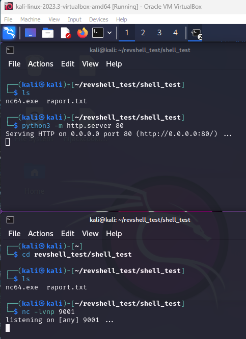

### h6 Attaaack Tämä läksy sisältää PhishSticks-tiimin (Halonen, Rajala ja Ollikainen) ehdotusten pohjalta tehtyjä läksyjä.

Teen tehtävät kannettavallani, jossa on Windows 11 Home, CPU: AMD Ryzen 7 2GHz, 8 ydintä, RAM 16 Gt ja VirtualBoxissa asennetuilla virtuaalikoneilla, joissa Kali ja Windows 10 Enterprise.

#### x) Lue/katso/kuuntele ja tiivistä.

(Tässä x-alakohdassa ei tarvitse tehdä testejä tietokoneella, vain lukeminen tai kuunteleminen ja tiivistelmä riittää. Tiivistämiseen riittää muutama ranskalainen viiva.)

##### € Yehoshua and Kosayev 2021: <a href="https://learning.oreilly.com/library/view/antivirus-bypass-techniques/9781801079747/">Antivirus Bypass Techniques</a>:

- <a href="https://learning.oreilly.com/library/view/antivirus-bypass-techniques/9781801079747/B17257_01_Epub_AM.xhtml#_idParaDest-18">Chapter 1: Introduction to the Security Landscape</a>

- overview of how cybercriminals are becoming more sophisticated and dangerous

- most of people's life is nowadays digital (shopping online, paying taxes online, social media, etc), so finding sensitive information on any regular person is easy

- cybercriminal aim to steal credit card, paypal and banking data, gather information on a target so they can sell it later, gather business information

- there is wide variety of products available that can help to deal with such  threats and protect users: Network Access Control (NAC), Intrusion Detection Systems (IDS)/Intrusion Prevention Systems (IPS), firewalls, Data Leak Prevention (DLP), Endpoint Detection and Response (EDR), antiviruses, etc - the simplest solution for PCs & other endpoints is antivirus software

- **malware** = malicious software; code, a payload or a file, whose purpose is to infiltrate and cause damage to the endpoint: get complete access, steal sensitive information, encrypt files and demand ransom, ruin the user experience, track the user and sell the information, show ads to user, attack third-party endpoints in a botnet attack

- **types of malware**: virus, worm, rootkit, downloader, ransomware, botnet, backdoor, PUP (potentionally unwanted program), dropper, scareware, trojan, spyware

- besides antivirus software, there are also other types of products that help to protect users from cyber threats (at the endpoint and network levels): EDR, firewall, IDS/IPS, DLP

- antivirus software's purpose is to detect and prevent the spread of malicious files and processes within operating system

- most of antivirus products are based on few **engines**, each having a different goal: 
  
  - static: the most basic; compares existing files within the operating system to a database of signatures and identifies malware this way
  
  - dynamic: checks the file at runtime, through, for exapmple, API monitoring or sandboxing
  
  - heuristic: can detect potentially malicious behavior of running process based on pre-defined behavioral rules
  
  - unpacking: aims to reveal malicious software payloads that have undergone "packing" or compression, tohide a malicious pattern

- methods and tools presented in this book were tested in LAN environment, using TCP protocol in **reverse shell**  (the listening fixed port will be open on  the attackers C2 server using a random source port that is opened on the victim endpoint; works behind NAT) and **bind shell**  (the malware acts as a server on the victim endpoint, listening on a fixed port or even several ports; the attacker can interact with the endpoint using these listening ports at any time the malware is running)

##### Halonen, Rajala ja Ollikainen 2023: <a href="https://www.youtube.com/@phishsticks_pentest/videos">PhishSticks Youtube Channel</a>, kahdeksan videota, yhteensä noin 15 min

Video "PhishSticks - The Ethical Hackers tool for Bad USB" on lyhyt, mutta hyvin selkeä ja kattava kuvaus "BadUSB" / PhishSticks käytöstä.

"Ethical Hacking with USB device - Reverse Shell" videolla näytetään miten hyökkääjä voi saada reverse shell yhteyden uhrin koneelle. Hyökkääjä laittaa NetCatin kuuntelemaan. Seuraava askel on saada haitallista koodia sisältävä USB tikku kiinni uhrin koneeseen. Sitten uhri klikkaa viattomalta näyttävää "tekstitiedostokuvaketta", joka taustalla ajaa skriptin, jonka avulla hyökkääjä saa reverse shell yhteyden ko. koneeseen.

Videolla "Ethical Hacking with Digispark - Keylogger with HTTP POST requests" demotaan keyloggerin käyttöä. Uhrin koneeseen yhdistetään digispark, ajetaan komento (joka ensin ohjelmoitiin digisparkille), joka lataa PowerShell keylogger skriptin ja ajaa sitä taustalla. Määrätyn ajan jälkeen digispark lähettää "nauhoitetun sisällön" POST pyynnöllä etäpalvelimelle, joka sitten tallentaa sen tekstitiedostoon. Myös videolla "Ethical Hacking with Digispark - Keylogger initial demo" niin ikään demotaan keyloggerin käyttöä/toimintaa.

Videolla "Ethical hacking with Digispark - ransomware initial demo" näytetään, miten digisparkia käyttämällä voidaan saada ladattua ja ajettua haitallista koodia uhrin koneella. Digisparkin yhdistäminen (uhrin) koneeseen automaattisesti suorittaa siihen ohjelmoituja komentoja. Myös videolla "Ransomware initial testing demo" demotaan, ransomware koodin toimintaa.

Videoilla "Reverse Shell - Initial testing demo" ja "BadUSB Reverse Shell using Flipper Zero" demotaan miten pahaa aavistamaton uhri voi omalla toiminnallaan avata reverse shellin oman ja hyökkääjän koneen välille. Jälkimmäisellä videolla tähän tarkoitukseen hyödynnetaan Flipper Zero laitetta.

##### Halonen, Rajala ja Ollikainen 2023: <a href="https://github.com/therealhalonen/PhishSticks/">PhishSticks Git Repository</a>, sivut:

- <a href="https://github.com/therealhalonen/PhishSticks/tree/master">README.md</a> (Aikajärjestyksessä, jos aloitat pohjalta. Kuvailee, miten näitä tekniikoita opeteltiin ja kehitettiin)
  
  PhishSticks projektin tiimin jäsenillä oli alusta alkaen selkeä työnjako. Uusia tekniikoita, skriptejä ja laitteita testatiin yhdessä ja erikseen. Nollasta uusien asioiden kehittämisen lisäksi hyödynnettiin myös valmiita, joita muokattiin projektin  tarpeisiin.

- <a href="https://github.com/therealhalonen/PhishSticks/tree/master/payloads/revshell">Revshell</a>

        Kerrotaan reverse shellin toteutuksesta tässä projektissa. Sivu sisältää myös reverse shell         skriptin.

- <a href="https://github.com/therealhalonen/PhishSticks/blob/master/documentation/Mitigations.md">Mitigations</a>
  
  Esitellään tapoja, miten suojautua PhishSticks projektin kaltaisia hyökkäyksiä vastaan:
  
  - disable PowerShell from user
  
  - block PowerShell from Windows firewall
  
  - disable Windows Run from user
  
  - ransomware protection - controlled folder access
  
  - disabling removable devices

- <a href="https://github.com/therealhalonen/PhishSticks/blob/master/notes/ollikainen/windows.md">Installing Windows 10 on a virtual machine</a>
  
  - ohjeet, miten asennetaan Windows 10 virtuaalikoneelle ja laitetaan ko. virtuaalikone samaan verkkoon hyökkäyskoneen kanssa

##### <a href="https://attack.mitre.org/resources/faq/">MITRE Att&ck Frequently Asked Questions</a>:

Part 1. General.  Erityisesti kehikon omat määritelmät termeille tactics, techniques and procedures

- What is ATT&CK - a knowledge base of cyber adversary behavior and taxonomy for adversarial actions across their lifecycle.  ATT&CK for Enterprise and ATT&CK for Mobile

- Why did MITRE develop ATT&CK - the reason to develop ATT&CK was the need to document adversary behaviors for use within a MITRE research project (FMX). ATT&CK was used as baseline for testing the efficacy of the sensors and analytics under FMX and it also served as the common language for both offense and defense could use

- What are "tactics" - the reason (why) of an ATT&CK technique of sub-technique; the adversary's tactical goal (wants to gain credential access)

- What are "techniques" - "how" an adversary achieves a tactical goal by performing an action (dumps credentials to achieve credential access)

- What are "sub-techniques" - more specific description of the adversarial behavior used to achieve a goal (for example, an adversary may dump credentials by accessing the Local Security Authority (LSA) Secrets)

- What are "procedures" - the specific implementation the adversary uses for techniques or sub-techniques (using PowerShell to inject into lsass.exe to dump credentials by scraping LSASS memory on a victim)

- What are the differences between sub-techniques and procedures - they describe different things in ATT&CK. Sub-techniques categorize behavior and procedures describe in-the-wild use of techniques. Procedures may include several additional behaviors in how they are performed.

- What technologies does ATT&CK apply to - *Enterprise IT systems covering Windows, macOS, Linux, Network infrastructure devices (Network), and Container technologies (Containers); cloud systems covering Infrastructure-as-a-Service (IaaS), Software-as-a-Service (SaaS), Office 365, Azure Active Directory (Azure AD), and Google Workspace; mobile devices covering Android and iOS.* 

- How can I use ATT&CK - there are several ways to use ATT&CK to help security operations, threat intelligence and security architecture. See for example <a href="https://attack.mitre.org/resources/getting-started/">Getting Started</a>.  Four most common use cases are *detection and analytics, threat intelligence, adversary emulation and red teaming, assessment and engineering.* 

##### <a href="https://attack.mitre.org/">MITRE Att&ck Enterprise Matrix</a>

Silmäile, poimi muutama esimerkki. Koko kehikko on laaja, eikä sitä tarvitse lukea tässä kokonaan.

- Execution -> (id) T1648 (name) Serverless Execution: Adversaries may abuse serverless computing, integration and automation services to execute arbitrary code in cloud environments. Example: In AWS, an adversary can use the ```IAM:PassRole``` permission or ``iam.serviceAccounts.actAs`` permission in Google Cloud to add *Additional Cloud Roles* to serverless cloud function (example: Lambda in AWS), so that it then may perform actions the original user cannot.

- Execution -> (id) T1569 (name) System Services: An adversary can abuse system services or daemons to execute commands or program. Malicious content can be executed by interacting with or creating services either locally or remotely. Goal might be to abuse system one-time or to perform temporary execution, but also persistence might be achieved (as many services are set to run at boot).
  
  - sub-technique example: (id) T1569.002 (name)  Service Execution - Windows service control manager may be abused to execute malicious commands or payloads. The Windows service control manager ``services.exe`` is an interface to manage and manipulate services. It is accessible to users via GUI and also system utilities such as ```sc.exe``` and <a href="https://attack.mitre.org/software/S0039/">Net</a>.
    - procedure example: (id) S0504 (name) Anchor - can create and execute services to load its payload.

- Initial Access -> (id) T1078 (name) Valid accounts: Adversaries can obtain and abuse credentials of existing accounts as a means of gaining Initial Access, Persistence, Privilege Escalation or Defense Evasion. Compromised credentials may be used to bypass access controls and even to gain persistent access to remote systems.
  
  - sub-technique example: (id) T1078.004 (name) Cloud Accounts - Services or user accounts may be subject to target through brute force, phishing, or other methods to gain access to environment. An attacker may create long lasting Additional Cloud Credentials (T1098.001) on a compromised cloud account to maintain persistence in the environment. 
    
    - procedure example: (id) G0007, (name) APT28 - has used compromised Office365 service accounts with Global Administrator privileges to collect email from user inboxes.

- Collection -> (id) T1115 Clipboard Data - on Windows, adversaries may access clipboard data by using ```clip.exe``` or ```Get-Clipboard```. Adversaries may also monitor and then replace users' clipboard with their data.
  
  - no sub-techniques
    
    - procedure example: (id) S0373 (name) Astaroth - collects information from the clipboard by using the ```OpenClipboard()``` and ```GetClipboardData()```  libraries.

#### a) The OS pwns you.

Asenna Windows virtuaalikoneeseen samaan verkkoon hyökkäyskoneen (esim. Kali, Debian) kanssa. Kokeile, että saat koneen irrotettua Internetistä

Tässä tehtävässä seuraan tätä <a href="https://github.com/therealhalonen/PhishSticks/blob/master/notes/ollikainen/windows.md">ohjetta</a>. 

Latasin Windows 10 Enterprise 64-bit edition. Avasin VirtualBoxin, klikkasin "New". Nimesin koneen "Windows 10 Enterprise" ja valitsin äsken ladatun tiedoston ISO-imageksi:

- RAM 8GB 

- 4 CPUs

- Create Virtual Hard Disk Now 

- -> Finish


Sitten **Start**. Käyttämääni ohjeesta poiketen, VirtualBox ei nyt kysynyt asennusmediaa, sillä valitsin sen jo virtuaalikoneen luomisvaiheessa. Seuraavaksi lokalisaatio:


**Next** -> **Install Now** -> **Accept License Agreement** -> **Custom Install** -> VHD (oletus) **Next**


Tämä vaihe kesti pari minuuttia. Sitten Windows kysyi aluetta (region) -> Finland -> Yes. Keyboard layout -> Finnish -> Yes.

Sitten pyydettiin kirjautumaan Microsoft tilillä. Ohjeen mukaisesti valitsin **Domain join instead**:


 **-> Next** 

-> Password setup

-> Security questions setup

-> Questions about my location and using my data; Valitsin ei ja minimit kaikessa.

Sitten odotellaan:


Ei kestänyt kuin reilun minuutin.

Nyt tällä virtuaalikoneella pääsee nettiin.


Seuraavaksi se laitetaan samaan verkkoon hyökkäyskoneeni (Kali) kanssa ja tarkistetaan, että se saadaan netistä irti.

Sammutin koneen. Avasin verkkoasetukset ja valitsin toiseksi verkkokortiksi saman kuin minulla on Kalissa ja Metasploitablessa niiden keskinäisessä verkossa, josta ne eivät pääse nettiin.


Pingasin ko. virtuaalikoneen IP:tä ```192.168.12.6```.


Sitten pingasin Kalia. Toimi:


Otin Ja Windows kone ei pääse nettiin. Adapter 2 on Host-only verkon adapteri, sama Kalissa:


#### b) Trustme.lnk.

*Kokeile PhishSticksin revshell vihamielistä tiedostoa, joka avaa käänteisen shellin hyökkääjän koneelle. Selitä, mitä tapahtuu ja miksi. Testaa, että pysyt antamaan kohdekoneelle komentoja reverse shellin kautta.* 

Kloonasin PhishSticks repon omalle koneelleni (Windows 11 kannettava; vain kopioinnin ajaksi) ja kopioin **revshell** kansion USB tikulle. Tein näin, koska se oli tällä hetkellä nopein tapa, jonka osaan, miten saada tiedostot tikulle. En osaa tehdä sitä Kalissa.

Loin Kalissa kotihakemistossani kansion **revshell_test**, johon kloonasin PhishSticks repon. Samassa kansiossa loin kansion **shell_test**, johon kopioin tiedoston **nc64.exe** (netcat windowsille; siinä vihamielinen tiedostomme ajaa komennon käynnistääkseen reverse shellin) ja loin hämäystekstitiedoston **raport.txt** sisällöllä ```Be careful with your devices! Ha-ha-haa.```. 

Kalissa (hyökkäyskone) käynnistin web-palvelimen, joka on tässä tarjoamassa tiedostoja **nc64.exe** ja **raport.txt** ja laitoin **netcat**in kuuntelemaan.



Nyt sitten tositoimiin :D  Avaan Windows virtuaalikoneella *vaarallisen* **usb-tikun** :)

Klikataan sitten tuota **Company raport** kuvaketta:


Sain tällaisen virheilmoituksen:


Jotain tein ilmeisesti väärin, mutta en osaa sanoa että mitä. Pakko siirtyä tekemään muita tehtäviä, ettei aika lopu kesken. Yritän palata tähän vielä.

Kun pidin pientä taukoa, niin tajusin missä oli vika. En määritellyt *attacker IP* osoitetta (Kali, 192.168.12.7) ja hyökkäyskoneella kuuntelevaa porttia (9001) alla olevassa tiedostossa. Siksi sitten kun kuvitteellinen uhri yritti avata **Company raport**ia, niin skripti ei saanut ladattua hyökkäyskoneelta ko. tekstitiedostoa. Ei se tietenkään saanut, kun se ei voinut tietää mistä (mistä IP:stä) se pitää hakea! :D


Kun sitten yllä mainitut asiat olivat kunnossa, kaikki toimi.

-> hyökkäyskoneella (Kali) menin kansioon, johon aiemmin tallensin tiedostot *nc64.exe* ja *raport.txt* 

-> käynnistin python-webpalvelimen ```python3 -m http.server 80``` 

-> laitoin netcatin kuuntelemaan ```nc -lvnp 9001``` 

-> "uhri"(Windows) yritti avata *Company raport* tiedostoa

-> skripti otti yhteyttä hyökkäyskoneeseen ja latasi sieltä *raport.txt* tiedoston ja avasi sen uhrikoneella

-> skripti latasi *netcat*in hyökkäyskoneelta ja avasi reverse shellin (hyökkäyskoneelle)


Testasin reverse shellin toimivuutta komennolla ```Get-LocalUser```, jonka tarkoituksena on kertoa meille uhrikoneella olevat paikalliset käyttäjätilit.


#### d) PageRank. Laita linkki raporttiisi <a href="https://terokarvinen.com/2023/eettinen-hakkerointi-2023/#comments">kurssisivun kommentiksi</a>.

- Kannattaa mainita URL sekä leipätekstissä ("Comment") että kotisivun osoitteessa ("Homepage"), jotta sitä on helppo klikata.

- Yksikin lause sisällöstä tai jostain kiinostavasta huomiosta lisännee klikkauksia

- PhishSticks etsii tästä viitattavia projekteja, joten tästä voi saada useita sisääntulevia linkkejä kerralla.

- Tämä kommentin lisääminen on erittäin suositeltava, mutta vapaaehtoinen. Olet kirjoittanut raportteja tunteja ja päiviä - miksi kirjoittaa pöytälaatikolle?

- Email-kohtaan pitää täyttää joku osoite, jotta se toimii. Voit laittaa tuohon oman osoitteen tai example.com.invalid-osoitteen, sillä osoite ei tule näkyviin.

- Hyväksyn kommentit käsin, ne tulevat siis näkyviin viiveellä.
- 

#### c) Attaaack! <a href="https://attack.mitre.org/">MITRE Attack Enterprise Matrix</a>

Demonstroi viisi tekniikkaa viidestä eri taktiikasta..

- Tekniikkaa tulee kokeilla käytännössä, kuvailu ei riitä.

- Asenna tarvittaessa omat harjoitusmaalit. Eristä tarvittaessa koneet Internetistä harjoittelun ajaksi.

- Voit käyttää kurssilla jo opeteltuja työkaluja (helpompaa) tai kokeilla uusia. Aiemminkin käytetyistä tekniikoista pitää tehdä uusi demonstraatio tässä tehtävässä.
  
  - Mikäli haluat tehtävästä helpon version, tekniikoiden valinta auttaa. Tuolta löytyy myös tuttuja ja helppoja tekniikoita.

- Selitä, mitä esimerkissä tapahtuu.

- Nimeä käytetyt taktiikat, tekniikat ja alitekniikat. Merkitse myös numerot T0123.456.

Tässä osuudessa hyödynnän virtuaalikoneet, jotka minulla on jo ennestään asennettuja: Kali (192.168.12.7), Metasploitable (192.168.12.3) sekä mahdollisesti Fedora Desktop (192.168.8). Koneet saavat yhteyttä toisiinsa (ping), mutta ei internettiin.

###### Reconnaissance

- Tekniikka id T1592 Gather Victim Host Information
  
  - Ali-tekniikka T1592.002 Software
  
  Hyökkääjä  yrittää saada tietoa kohteesta, kuten kuuntelevat portit, yms, esimerkiksi aktiivisen skannauksen tai phishing tekniikoiden avulla.
  
  Kokeilin skannata Fedoraa Kalista. Käytin **nmap**ia, komentoa ```sudo nmap -sA 192.168.12.8``` 
  
  -sA skannaa mm. mahdollisen kohteen version (OS)
  
  
  
  En saanut version (OS; mutta tiedossa toki on, että se on Fedora), mutta sain muita tietoja. Kaikki skannatut portit ovat ignored-tilassa. 846 porttia ovat *unfiltered*, mikä tarkoittaa, että ne ovat *accessible*, mutta nmap ei pysty toteamaan, onko ne auki vai kiinni. 147 porttia ovat *filtered* tilassa. Se tarkoittaa, että nmap ei pysty toteamaan, ovatko portit auki, koska jokin estää sen (palomuuri tms), eikä se ole saanut näistä porteistä mitään vastausta. 7 muuta porttia on myös *filtered* tilassa, mutta ne on lisäksi *admin-prohibited*. Tämä tarkoittaa, että nmap on lähettänyt näille porteille "jotakin" ja saanut vastaukseksi ICMP 'Admin-prohibited' vastauksen - eli jokin aktiivisesti blokkaa sitä (palomuuri, tms). Skannaus sai selville kohteen verkkokortin MAC osoitteen, tässä tapauksessa se on toki VirtualBoxin virtuaaliverkkokortti.


En keksinyt, miten demonstroisin 4 seuraavaa tekniikkaa, joten päädyin siihen, että edes kuvailen ne tänne alle:

##### Initial Access

- Tekniikka id T1078 Valid Accounts
  
  Hyökkääjät voi päästä käsiksi ja väärinkäyttää olemassa olevien tilien käyttäjätunnuksia ja salasanoja, jotta he saavat ensimmäisen pääsyn kohdejärjestelmään, pyrkivät pysymään siellä, korottamaan/laajentamaan käyttöoikeuksia tai kiertämään puolustusta/tietoturvaa (palomuurit, IDS/IPS, tunnukset, ...).
  
  - Ali-tekniikka id T1078.003 Local Accounts
    
    Kuten ylempänä. Lisäksi: Paikalliset tilit ovat tilejä, jotka organisaatio on määrittänyt käyttäjien, etätuen, palveluiden tai yksittäisen järjestelmän tai palvelun hallintaan. 

##### Persistence

- Tekniikka id T1098 Account Manipulation
  
  Hyökkääjät voivat manipuloida tilejä ylläpitääkseen ja/tai korottaakseen/laajentaakseen pääsyä kohdejärjestelmiin. Tilien manipulointi voi olla mikä vaan toiminta, joka säilyttää tai muokkaa hyökkääjän pääsyä  vaarantuneille (compromised) tileille. Esimerkiksi tunnusten tai käyttöoikeusryhmien muokkaaminen.
  
  - Ali-tekniikka id T1098.005 Device Registration
    
    Hyökkääjät voivat rekisteröidä hallitsemalleen kohdejärjestelmän tilille laitteen, jota he voivat sitten hyödyntää esimerkiksi monivaiheisen tunnistautumisjärjestelmän huijaamiseen

##### Privilege Escalation

- Tekniikka id T1053 Scheduled Task/Job
  
  "*Adversaries may abuse task scheduling functionality to facilitate initial or recurring execution of malicious code.*"
  
  Hyökääjät voivat väärinkäyttää palveluiden/tehtävien ajoitustoimintoa, ja siten mahdollistaa haitallisen koodin ensimmäisen tai toistuvan suorittamisen.
  
  - Ali-tekniikka id T1053.003 Cron
    
    Hyökkääjät voivat ylempänä kuvailtuun toimintaan cron-apuohjelmaa. Crontab-tiedosto sisältää cron-merkintöjen aikataulun ja määritetyt suoritusajat. Kaikki crontab-tiedostot tallennetaan käyttöjärjestelmäkohtaisiin tiedostopolkuihin. Hyökkääjät voivat hyödyntää tätä toiminnallisuutta haitallisten ohjelmien suorittamiseen järjestelmän käynnistyksen yhteydessä tai määritetyn aikataulun mukaan.

##### Impact

- Tekniikka id T1561 Disk Wipe
  
  Hyökkääjät voivat tyhjentää tai rikkoa raakalevytietoja (raw disk data) tietyissä järjestelmissä tai suurissa määrissä tietoverkoissa ja näin keskeyttää järjestelmän ja verkkoresurssien saatavuutta/käytettävyyttä.
  
  - Ali-tekniikka id T1561.001 Disk Content Wipe
    
    Hyökkääjät voivat poistaa tallennusresurssien sisällön ja siten häiritä/keskeyttää järjestelmän ja verkkoresurssien saatavuutta/käytettävyyttä.

#### d) Vapaaehtoinen:

Total attak! Demonstroi yksi tekniikka jokaisesta MITRE Attack -taktiikasta. (Noista aiemmin tehdystä viidestä ei tarvitse tehdä uutta demonstraatiota.) <a href="https://attack.mitre.org/">MITRE Attack Enterprise Matrix</a> 

#### e) Vapaaehtoinen:

Kokeile jokin toinen hyökkäystekniikka PhishSticks-projektista.

#### f) Vapaaehtoinen:

Tee oma RAT tai malware ja testaa sitä. Miten tunnistaisit oman haittaohjelmasi ja estäisit sen toiminnan? (Kotitehtävissä ei tehdä matoja tai muita itsestään leviäviä ohjelmia. Katso turvallisuusvinkit alta).

#### Lähteet:

https://attack.mitre.org/

https://attack.mitre.org/resources/faq/

https://terokarvinen.com/2023/eettinen-hakkerointi-2023/#comments

https://learning.oreilly.com/library/view/antivirus-bypass-techniques/9781801079747/

https://learning.oreilly.com/library/view/antivirus-bypass-techniques/9781801079747/B17257_01_Epub_AM.xhtml#_idParaDest-18

https://www.youtube.com/@phishsticks_pentest/videos

https://github.com/therealhalonen/PhishSticks/

https://github.com/therealhalonen/PhishSticks/tree/master

https://github.com/therealhalonen/PhishSticks/tree/master/payloads/revshell

https://github.com/therealhalonen/PhishSticks/blob/master/documentation/Mitigations.md

https://github.com/therealhalonen/PhishSticks/blob/master/notes/ollikainen/windows.md

https://attack.mitre.org/software/S0039/

https://www.microsoft.com/en-us/evalcenter/download-windows-10-enterprise
