### h7 Hash

Harjoitukset ja tehtävät toteutan pöytäkoneellani:

- Windows 10 Pro

- PCU Intel i5 3.30 GHz

- RAM 8 Gt

Käytössä myös VirtualBoxissa asennettu virtuaalikone, jossa Kali. 


#### Lue/katso/kuuntele ja tiivistä.

##### Karvinen 2022: <a href="https://terokarvinen.com/2022/cracking-passwords-with-hashcat/">Cracking Passwords with Hashcat</a>

Hashcat on työkalu, jonka avulla voidaan selvittää, minkä sanan (salasanan) tiiviste täsmää annettuun tiivisteeseen - tarkistamalla sanakirjan jokaisen sanan tiivistettä ja kertomalla, mikäli jokin niistä täsmää.

-> asenna hashcat ```sudo apt-get -y install hashid hashcat wget``` 

-> luo uusi kansio salasanatestausta varten ```mkdir hashed``` ja siirry siihen ```cd hashed``` 

-> luo tai lataa iso sanakirja. *Rockyou* on todennäköisesti tunnetuin, siinä on yli 14 miljoonaa sanaa

```
wget https://github.com/danielmiessler/SecLists/raw/master/Passwords/Leaked-Databases/rockyou.txt.tar.gz
tar xf rockyou.txt.tar.gz
rm rockyou.txt.tar.gz
```

-> selvitä hash-tyyppi

Oikea vaihtoehto on usein top 3 joukossa:

```
hashid -m 6b1628b016dff46e6fa35684be6acc96
Analyzing '6b1628b016dff46e6fa35684be6acc96'
[+] MD2 
[+] MD5 [Hashcat Mode: 0]
[+] MD4 [Hashcat Mode: 900]
...
```

-> Crack the Hash!

```
 hashcat -m 0 '6b1628b016dff46e6fa35684be6acc96' rockyou.txt -o solved
```

-> lue ratkaistu hash tiedostosta *solved* (nimi määritelty edellisessä kohdassa ```-o solved```)

```
cat solved 
6b1628b016dff46e6fa35684be6acc96:summer
```

Jos tuloksena on *Status: Exhausted*, eikä *Cracked*, se tarkoittaa, että sanakirjan kaikki sanat kokeiltiin, mutta yksikään ei ollut oikein.

Mikäli et määritä tiedostoa, mihin tulos tallennetaan (``-o <tiedoston nimi>``), voi käyttää ```--show```:

```
 hashcat -m 0 6b1628b016dff46e6fa35684be6acc96 rockyou.txt 
... INFO: All hashes found in potfile! Use --show to display them. ...

$ hashcat -m 0 6b1628b016dff46e6fa35684be6acc96 rockyou.txt --show
6b1628b016dff46e6fa35684be6acc96:summer
```

##### Karvinen 2023: <a href="https://terokarvinen.com/2023/crack-file-password-with-john/">Crack File Password With John</a>

*John the Ripper* on työkalu, jonka avulla voidaan murtaa tiedostojen salasanoja *salasanahyökkäyksellä*. 

-> edellytykset kuntoon, asenna:

```
sudo apt-get -y install micro bash-completion git build-essential libssl-dev zlib1g zlib1g-dev zlib-gst libbz2-1.0 libbz2-dev atool zip wget
```

- micro, tekstieditori

- bash-completion,  käytä tab tiedostojen nimen täydentämiseen kirjoittaessa

- git, kloonaa Jumbo John lähdekoodi

- build-essential; C-kompileri ja siihen liittyvät työkalut

- libssl-dev, *John*in edellytykset

- zlib 1g zlib 1g-dev zlib 1g-gst, John ZIP tuki

- libbz2-1.0 libbz2-dev, John 7zip tuki

- atool zip, pakkaustyökalut, 'aunpack foo.zip', 'unzip foo.zip'

- wget, komentorivillä käytettävä lataustyökalu

-> lataa ja käännä John the Ripper, Jumbo versio

```
git clone --depth=1 https://github.com/openwall/john.git
cd john/src/
./configure

make -s clean && make -sj4

cd../run/
ls -1
1password2john.py
7z2john.pl
DPAPImk2john.py
adxcsouf2john.py
aem2john.py
...
cd
```

-> Let's run it! Jos tuloksena on mm. Johnin versionumero, se tarkoittaa, että lataus, kääntäminen ja ajo toimii kuten pitäisi.

```
$HOME/john/run/john 
John the Ripper 1.9.0-jumbo-1+bleeding-3423642 2023-01-19 00:38:00 +0100 OMP [linux-gnu 64-bit x86_64 AVX2 AC]
Copyright (c) 1996-2022 by Solar Designer and others
Usage: john [OPTIONS] [PASSWORD-FILES]
```

-> ZIP salasanan murtaminen:

- laita hash arvo erilliseen tiedostoon ```$HOME/john/run/zip2john tero.zip >tero.zip.hash```

- aja Johnilla sanakirjahyökkäys ko. hash-arvoon ```$HOME/john/run/john tero.zip.hash```
  
  - tuloksena monen monta riviä tekstiä ruudulla, mutta tärkein rivi on ```butterfly        (tero.zip/secretFiles/SECRET.md) ``` 

-> pura salattu ZIP tiedosto

```
unzip tero.zip 
Archive:  tero.zip
[tero.zip] secretFiles/SECRET.md password: [type password here, it's not echoed]
  inflating: secretFiles/SECRET.md
```

->  lue purettu tiedosto **cat** komennolla :)

#### a) Hashcat

*Asenna Hashcat ja testaa sen toimivuus ratkaisemalla tiiviste.*

Aloitin päivittämällä virtuaalikoneeni. Sitten asensin Hashcatin komennolla ```sudo apt-get -y install hashid hashcat wget``` 

Loin kansion, johon voin myöhemmin laittaa tähän tehtävään liittyvät tiedostot ```mkdir hashtest```ja siirryin siihen komennolla ```cd hashtest```.  Tähän kansioon sitten latasin **rockyou.txt** sanakirjan komennolla ```wget https://github.com/danielmiessler/SecLists/raw/master/Passwords/Leaked-Databases/rockyou.txt.tar.gz```. Tiedosto oli pakattu, joten seuraavaksi purin sen ja poistin pakatun version:

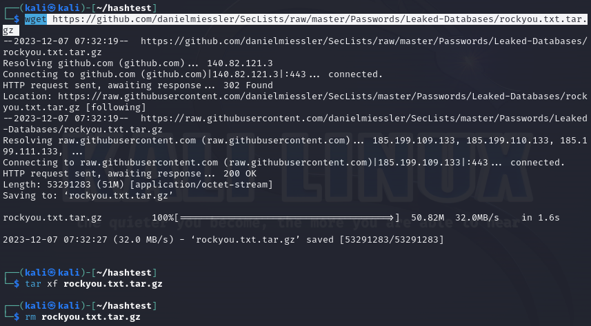

Esimerkki, hash-arvon luominen <a href="https://www.md5hashgenerator.com/">MD5 Hash Generaattorilla</a>:

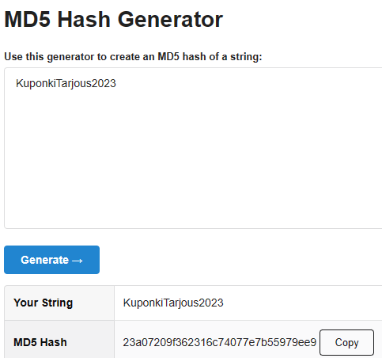

Kuten oletettu, Hashcat osasi kertoa, millä algoritmilla on hash-arvo luotu, MD5:

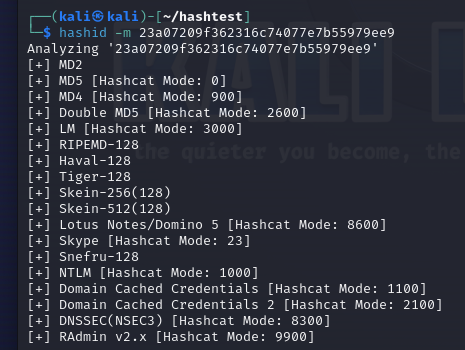

Hashcat toimi kuten pitääkin, mutta salasana ei löytynyt sanakirjasta:

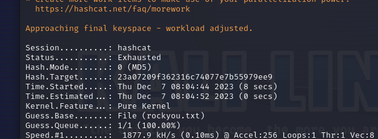

Kokeillaan jotain englanninkielistä salasanaa:

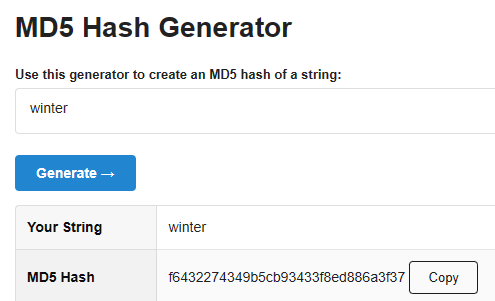

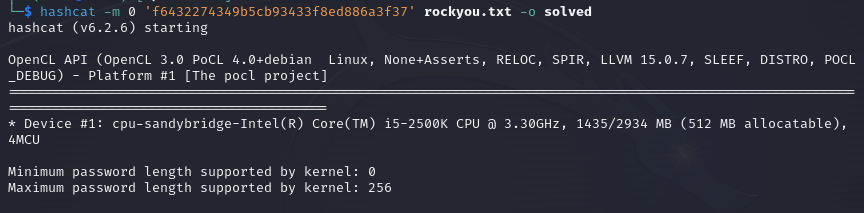

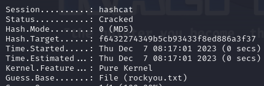

Tuo jälkimmäinen on tämän tehtävän hash-salasana pari:

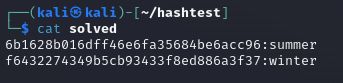

#### b) John

*Asenna Jumbo John ja testaa sen toimivuus murtamalla jonkin tiedoston salasana.*

Alkuun edellytysten asennus:

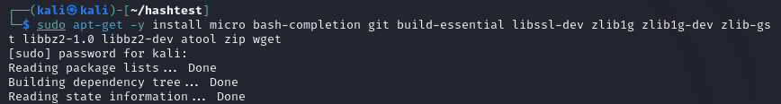

Siirryin kansioon **john/src/** ja ajoin komennon **./configure**. Sen tarkoituksena on tarkistaa ympäristön (environment) ja luo Makefile-tiedoston 'make'-komentoa varten. Sain virheilmoituksen:

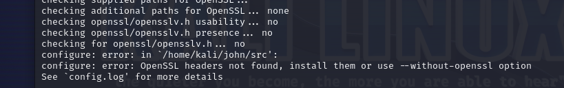

OpenSSL headerit puuttuivat, joten asensin ne:

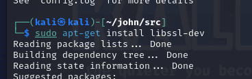

Ja ajoin **./configure** uudestaan, tällä kertaa onnistuneesti:


Tästä sitten saatiin komento seuraavaa askelta varten, eli kääntäminen ```make -s clean && make -sj4```. Kesti 3 minuuttia.

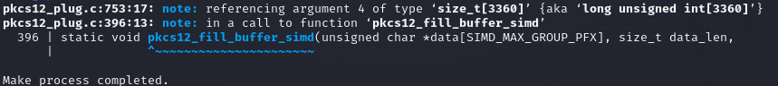

Downloaded, compiled and running!

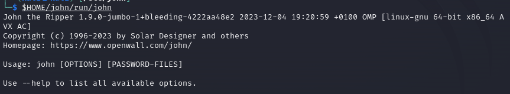

Testatakseni, toimiiko john kuten pitääkin, kokeilen sitä salasanasuojatulle ZIP tiedostolle, joka on tarjolla ylempänä raportissa mainitussa <a href="https://terokarvinen.com/2023/crack-file-password-with-john/">Tero Karvisen artikkelissa</a>.

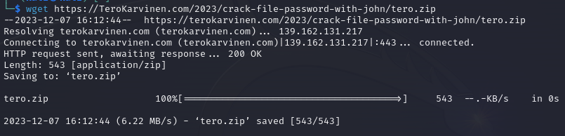

...jota ei pysty purkamaan, kuten odotettukin:

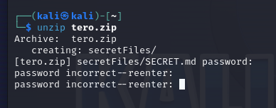

Kokeillaan, auttaisiko **john**:

**Ensimmäinen askel**, ZIP tiedoston hash arvo uuteen tiedostoon *tero.zip.hash*. Kurkkasin myös, miltä se (hash-arvo) näyttää:

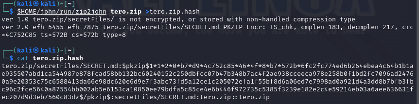

**Toinen askel**, sanakirjahyökkäys hash-arvoon:

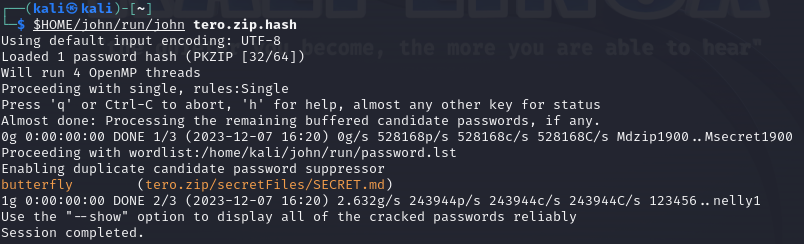

Siinä se on, **butterfly**! Tarkistetaan toimivuutta purkamalla ZIP tiedostoa:

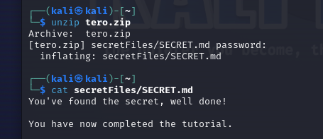

#### c) f5bc7fcc7f5b3b6af7ff79e0feafad6d1a948b6a2c18de414993c1226be48c1f on erään kurssisivulla olevan yksittäisen sanan tiiviste.

*Käytetty tiivistealgoritmi on hyvin yleinen ja tunnettu. Sanassa voi olla isoja kirjaimia, mutta ei erikoismerkkejä. Minkä sanan tiiviste on kyseessä?*

Ensin luodaan sanakirjatiedosto kurssisivusta:

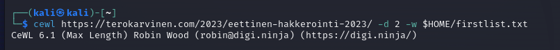

Saatiin tämän tyylinen lista:

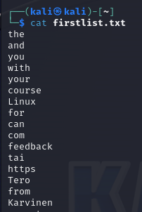

Yli 18 000 sanaa!

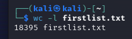

Hyödynnetään Hashcatia. Selvitetään, millä algoritmilla on selvitettävä hash-arvo saatu aikaan:

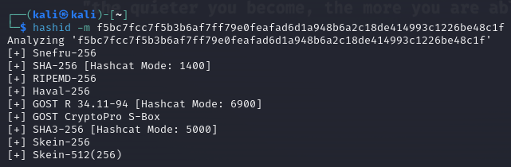

Veikkaan, että oikea algoritmi on SHA-256, sillä se on hyvin yleinen ja tunnettu. Kokeillaan:

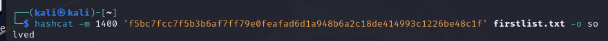

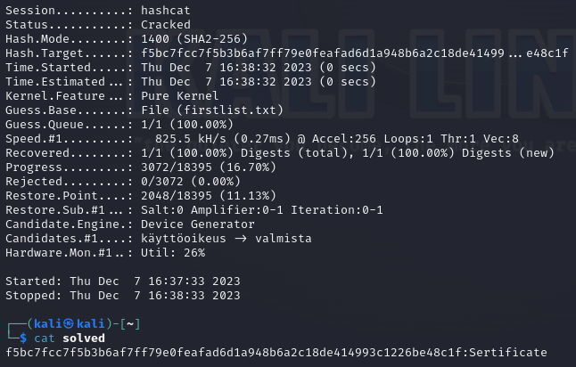

Eli kyseessä on sanan **Sertificate** tiiviste. Veikkaus, että SHA-256 algoritmi käytettiin oli siis oikea. Hash-arvon tarkistus, täsmää:


#### d) Cheatsheet

*Kerää kurssilaisten raporteista käteviä tekniikoita. Kerää itse tekniikat ja komennot, älä pelkästään kuvaile. Muista lähdeviitteet. Tee tiivis ja selkeä cheatsheet, josta löydät tarvittavat tiedot lipunryöstössä. (Tässä alatehtävässä ei tarvitse tehdä testejä koneella)*

- **"-":llä alkavan tiedoston avaaminen** `cat ./-` 

- **SSH-yhteys palvelimelle** ```ssh <palvelimen osoite> -p <portin numero>``` 

- **Reversed image search** - auttaa etsimään, missä yhteydessä jokin kuva internetissä esiintyy. Työkaluna esimerkiksi <a href="https://tineye.com/">TinEye</a> 

- **SQL kommentti-merkki "--"**, laittamassa sen URLissä loppuun, voidaan "kommentoida pois" kaikki sen ja **" ' "** välissä. Se mahdollistaa sen, että noiden merkkien väliin voidaan laittaa sellaisia SQL-kysely/-ehtoja, joita halutaan. Esimerkki: **/filter?category=Accessories'+OR+1=1--** = näkyviin saadaan myös julkaisemattomat tuotteet

- **Web Fuzzing**: Ffuf, Burp Suite, Owasp ZAP, GoBuster, ... Satunnaisten/sanakirjaan pohjautuvien arvojen syöttäminen. Tämän avulla voidaan löytää piilotettuja kansioita/tiedostoja/haavoittuvuuksia hakupyyntöjen parametreissa. Kts myös [Teron artikkeli]([Find Hidden Web Directories - Fuzz URLs with ffuf (terokarvinen.com)](https://terokarvinen.com/2023/fuzz-urls-find-hidden-directories/)) fuzzauksesta.
  
  - **FFUF**, web fuzzing leading tool. Pyyntöjä tehdessä voi hyödyntää erilaisia parametreja:
    
    - *-w*: sanalista
    
    - *-u*: URL, johon fuzzaus kohdistetaan
    
    - *-e*: laajennettu haku; voi lisätä esim ".txt", silloin etsitään polkuja/tiedostoja, jotka päättyvät ".txt"
    
    - *-v*: verbose, yksityiskohtaisempaa tietoa pyynnön edistymisestä
    
    - *-mc*: "match code?", tämä parametri yhdistettynä esim. arvoon 429 näyttää vain vastaukset, jotka sisältävät HTTP-tilakoodin 429
    
    - *-fs*: filter (by) size, suodattaa pois kaikki vastaukset, joiden pituus on tämän parametrin arvon mukainen
    
    - *-t*, luo määrätyn määrän verran versioita ffuf työkalusta
    
    - *-p*, työkalu odottaa määrätyn ajan verran jokaista pyyntöä kohti
    
    - *-H "Host: FUZZ.ffuf.me (tämä on esimerkki)*, etsii aliverkkotunnuksia virtuaalisten isäntien (virtual host) ja Host-otsikon muuttamisen avulla 
    
    - FUZZ on kohta, johon fuzzaus kohdistetaan

- **Sherlock**, Python pohjainen *OSINT-työkalu*, joka on suunniteltu etsimään käyttäjätilejä ja muita online tunnisteita eri somen ja verkkopalveluiden alustoilta [GitHub - sherlock-project/sherlock: 🔎 Hunt down social media accounts by username across social networks](https://github.com/sherlock-project/sherlock)

- **Nmap skannaus, 1000 tavallisinta TCP porttia**, hitaampi kuin -sS, muodostaa yhteyden kohdejärjestelmään ```nmap -sT <ip osoite>```

- **Nmap skannaus, SYN-skannaus, nopea ja huomaamaton**, "puoliksi avoin", lähettää SYN-paketteja ja odottaa vastausta -> voidaan erottaa avoimet, suljetut, suodatetut portit ```nmap -sS <ip osoite>``` 

- **Nmap skannaus, kaikki TCP portit** ```nmap -p-  <ip osoite>```

- **Nmap skannaus, UDP**, hidas ja haastava, lähettää UDP-paketin jokaiseen kohdejärjestelmän porttiin ja tulkitsee vastauksia ICMP-virheviesteistä ```nmap -sU <ip osoite>``` 

- **Nmap skannaus, laaja** ```nmap -A```. *Aggressive*; käyttöjärjestelmän tunnistaminen, versioskannaus, skriptien skannaus, paketin reitin kulun jäljittäminen (--traceroute)

- **Nmap skannaus, ping sweep** ```nmap -sn```, "Onko kohdejärjestelmä "päällä"?"

- **Nmap skannaus, don't ping** ```nmap -Pn``` 

- **Nmap skannaustulosten lähettäminen tiedostoihin** ```nmap -oA tulokset localhost``` - nmap tallentaa skannaukset tulokset tulokset-nimisiin tiedostoihin formaateissa gnmap, nmap ja xml

- **MSF konsoli Kalissa**:
  
  - tarkista, että PostgreSQL pyörii, sen jälkeen:
    
    - ensin ```sudo msfdb init```
    
    - sitten ```sudo msfconsole``` 
    
    - komento ```sudo msfdb run``` tekee edellä mainitut askeleet suoraan, komento ```db_status```tarkistaa yhteyden msf:hen sekä yhteyden tyypin (postresql)
  
  - perusteellinen kohdejärjestelmän skannaus ```db_nmap -A -p0- <ip osoite>``` 
  
  - komennolla ```search *esimerkki*``` voi etsiä haavoittuvuuksia niiden nimillä
    
    - **use** yhdistettynä numeroon; search-haku palauttaa listan mahdollisia exploiteja, use + numero valitsee, mikä niistä käytetään
    
    - **RHOST <ip osoite>** mihin exploit kohdistetaan  
  
  - **searchsploit** etsii exploiteja
  
  - jos on päässyt kohdejärjestelmään ja sai siellä session auki, sen voi "parantaa":
    
    - siirry taustalle ```ctrl + Z``` 
    
    - kalissa, msf konsolissa voi etsiä *search* komennolla exploitin, jolla saa session paremmaksi, esim. ```search shell_to_meterpret``` 
      
      - **use-komento** valitse exploit
      
      - listaa sessiot **session -l**
      
      - set sessions + valitse numero -> run
      
      - sitten jos taas listaa istunnot, listalla tulisi olla 2

- **Nikto**, open-source työkalu web palvelinten skannaamiseen. Etsii palvelinten ja palvelinohjelmistojen vääriä/ongelmallisia konfiguraatioita, oletustiedostoja ja -ohjelmia, haavoittuvia tiedostoja ja ohjelmia, vanhoja versioita palvelimista ja ohjelmista, jne. Kts [Nikto]([Overview & Description · sullo/nikto Wiki (github.com)](https://github.com/sullo/nikto/wiki/Overview-&-Description))

- **ZAP**, *man-in-the-middle proxy* Sieppaa ja muokkaa web sovellusten hakupyyntöjä, liikennettä, ... Siinä voi myös muokata siepattuja hakupyyntöjä.

- **IDOR** - insecure direct object reference; URL:issa voi näkyä suora viittaus tiedoston sijaintiin palvelimella. URLeja voi muokata esimerkiksi ZAPissa kaappaamalla liikenteen ja ottamalla sitten oikeat hakupyynnöt manual request editoriin muokkaukseen. Kts [h4 läksy, IDOR](https://github.com/JanaHalt/Ethical-Hacking-2023/blob/main/h4%20Totally%20Legit%20Sertificate.md#c-insecure-direct-object-reference-idor) 

- **Path traversal**, muokkaamalla hakupyynnön URL:ia voidaan päästä käsiksi sellaisiinkin tiedostoihin, joita web-palvelun luonut taho ei tarkoittanut ulkopuolisten nähtäväksi Kts [h4 läksy, path traversal, simple](https://github.com/JanaHalt/Ethical-Hacking-2023/blob/main/h4%20Totally%20Legit%20Sertificate.md#d-file-path--traversal-simple-case)

- **Server-side template injection** - muokkaamalla web palvelun palvelimen käyttämää templatea voidaan syöttää siihen haitallista koodia ja palvelin sitten suorittaa sen "omalla puolella" ja näyttää web sivun, jossa näkyy muokatun templaten mukaiset tiedot. Kts esimerkiksi [Seven Seas Security - SSTI]([(169) SSTI Complete Lab Breakdown: SSTI w/ info disclosure via user-supplied objects - YouTube](https://www.youtube.com/watch?v=8o5QPU-BvFQ))

- **Server-Side Request Forgery** - muokkaamalla palvelimeen kohdistuvaa POST-pyyntöä voidaan päästä sellaiselle palvelimella olevalle sivulle, joka mahdollistaa esim. käyttäjien poistamisen yms. Kts esimerkiksi [Jennin raporttia aiheeseen liittyvästä tehtävästä](https://github.com/jjenska/PenTest/blob/main/h4/h4.md#h-basic-ssrf-against-the-local-server) 

- **Cross-site scripting** -  web sivuilla on usein esim. hakukenttä, jonka avulla käyttäjät voivat etsiä haluamiaan asioita. Nämä kohdat voivat olla haavoittuvia sille, että niihin saattaa voida laittaa skriptia (scrip injection), esim. ```<script>alert('VARO');</script>``` syöttäminen hakukenttään tekee sen, että web sivulle tulee ilmoitusikkuna, jossa lukee "VARO". Voidaan hyödyntää esim. autentikoinnin ohittamiseen.

- **ZAP**issa voi siepata liikenteen ja muokata vaikka cookie-arvoja, joita voi hyödyntää esim. autentikoinnin ohittamiseen. Siepatusta liikenteestä voi löytyä myös käyttäjätunnukset ja salasanat selkotekstisenä. Kts [Jennin raporttia aiheeseen liittyvästä tehtävästä](https://github.com/jjenska/PenTest/blob/main/h4/h4.md#m-a1-broken-access-control-webgoat-20234) tai [raporttiani tähän liittyen](https://github.com/JanaHalt/Ethical-Hacking-2023/blob/main/h4%20Totally%20Legit%20Sertificate.md#ratkaise-webgoat-20234) 

- **PostgreSQL**:
  
  - asennus `sudo apt-get install postgresql` ja käynnistys ```sudo systemctl start postgresql```
  
  - tietokannan luominen ```sudo -u postgres createdb *oma käyttäjänimi*``` ja käyttäjän luominen tietokantaan ```sudo -u postgres createuser *oma käyttäjänimi*```
  
  - tietokannan avaaminen ```psql```, apua saa ```help``` illä ja poistua voi ```q``` llä
  
  - taulun luominen ```CREATE TABLE``` ja arvojen lisääminen ```INSERT INTO``` 
  
  - haluttujen arvojen tarkasteluun voi käyttää ```SELECT```, arvojen päivittämiseen ```UPDATE``` ja tietueiden poistamiseen ```DELETE```
  
  - tauluilla on aina oltava pääavain (primary key), helpointa ```SERIAL``` avulla
  
  - kts [oma raportti tähän liittyen ](https://github.com/JanaHalt/Ethical-Hacking-2023/blob/main/h5_injected_sequel.md#a-crud) 

- **SQL injektio**, esimerkki: ```SELECT * FROM customers WHERE name=' ' OR 1=1--``` <- tämä hakupyyntö palauttaa kaikki käyttäjät taulukosta **customers**
  
  - **SQL injection vulnerability allowing login bypass**, muokataan kirjautumiseen liittyvä POST-pyyntö: username=*haluamamme käyttäjänimi*'-- Merkit ``'--``  "kommentoivat" pois sen osan POST pyyntöä, jossa tarkistetaan salasana ja siten päästään kirjautumaan ilman sitä.

- **UNION attack**, *UNION select sql lauseke*. Mahdollistaa hakea tietoa muistakin tietokannassa olevista taulukoista kuin pelkästään siitä, johon varsinainen hakupyyntö kohdistetaan. Esimerkit:
  
  - Oracle-tietokannoissa on pakko olla **FROM** jokaista **SELECT** hakupyyntöä kohti: ```' UNION SELECT NULL FROM DUAL--``` 
  
  - Using a SQL injection UNION attack to retrieve interesting data: ``' UNION SELECT username, password FROM users--``  
  
  - Retrieving multiple values within a single column: ```' UNION SELECT username || '~' || password FROM users--```
  
  - Syntax on vastaava muissakin tietokannoissa (MySQL, Microsoft), pienin eroin. Kts [Jennin raporttia aiheeseen liittyen](https://github.com/jjenska/PenTest/blob/main/h5/h5.md#f-sql-injection-attack-querying-the-database-type-and-version-on-mysql-and-microsoft) 

- **MITRE ATT&CK**
  
  - Tactics: kertoo miksi tekniikkaa tai alatekniikkaa käytetään.Kuvailee maalin - mihin hyökkääjä haluaa päästä ko. toiminnolla
  
  - Techniques: kertoo miten maali tavoitetaan
  
  - Procedures: kertoo tietynlaisesta täytäntöönpanosta, jota hyökkääjä käyttää.

- **python3 -m http.server 80** avaa web palvelimen (http) portille 80

- **nc -lvnp 9001** laittaa netcatin kuuntelemaan portille 9001

#### e) Viittaa

*Tarkista, että jokaisessa raportissasi on lähdeviitteet kunnossa. Jokaisen raportin tulee viitata ainakin kurssiin / tehtäväsivuun. Kaikkiin muihinkin käytettyihin lähteisiin tulee viitata, kuten kurssikavereiden raportteihin, weppisivuihin, man-sivuihin... (Tässä alatehtävässä ei tarvitse tehdä testejä koneella).*

#### f) Vapaaehtoinen

*Kertaa. Harjoittele. Kannattaa kerrata tai täydentää eritoten h4 Totally Legit Sertificate.* 

#### g) Vapaaehtoinen

*Tee h8 Extrabonus, jos haluat.*

##### Lähteet:

https://terokarvinen.com/2023/eettinen-hakkerointi-2023/#h7

https://terokarvinen.com/2022/cracking-passwords-with-hashcat/

https://terokarvinen.com/2023/crack-file-password-with-john/

https://www.md5hashgenerator.com/

https://www.hackingarticles.in/5-ways-create-dictionary-bruteforcing/

https://passwordsgenerator.net/sha256-hash-generator/

https://github.com/jjenska/PenTest/blob/main/h1/h1.md

https://tineye.com/

https://terokarvinen.com/2023/fuzz-urls-find-hidden-directories/

https://github.com/sullo/nikto/wiki/Overview-&-Description

https://github.com/Jiikiam/PenTestingCourse/

https://github.com/sawulohi/PenTest/

https://github.com/LassiMik/44

https://github.com/Viktorialissa/PenTest/
